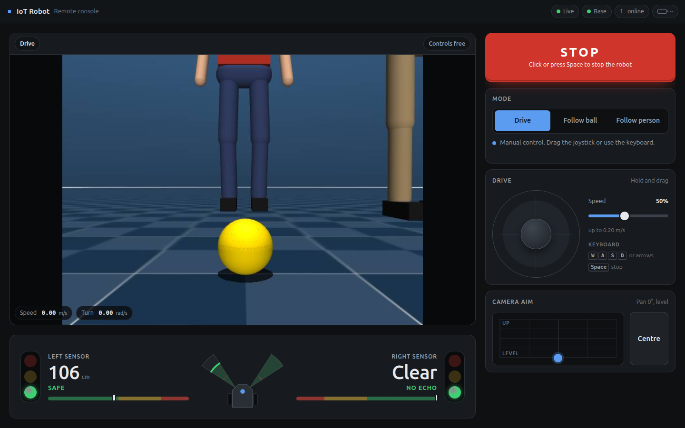

# iot_robot

A differential-drive robot with a pan/tilt camera, built on ROS 2 Jazzy and simulated in MuJoCo.
The goal is vision-based following: first a yellow ball, then a specific person recognised by
appearance, with distance estimated from a single camera.

The whole ROS environment is managed by [pixi](https://pixi.sh) using
[RoboStack](https://robostack.github.io) packages, so no system ROS install is needed.

## Hardware

| Part | Details |
| --- | --- |
| Computer | Raspberry Pi 4 Model B, running the `robot` pixi environment |
| Motors | 4 × CubeMars AK45-10 (10:1, 7 N·m peak, 180 rpm output) on a 1 Mbit/s CAN bus through a native SocketCAN USB-CAN adapter: the two wheels (CAN IDs 12 and 13) and the gizmo's yaw and pitch (10 and 11), set in [`motors.yaml`](src/iot_robot_bringup/config/motors.yaml) |
| Camera | Raspberry Pi Camera v2.1 (IMX219, 62.2° × 48.8° FOV) on the pan/tilt "gizmo" |
| Range | 2 × HC-SR04P ultrasonic sensors angled ±45° forward, read by a Nucleo-F401RE (STM32) over USB serial |
| IMU | LSM9DS1 on the Pi's I2C bus |
| Power | 6S LiPo (24 V nominal) with an XT60 plug and a main switch; an E-stop cuts power to the motors; 5.1 V buck converter for the Pi |

The Raspberry Pi controls all four motors over CAN, through `ros2_control`. The Nucleo only
reads sensors (the ultrasonic sensors and, optionally, the battery voltage) and drives no
motors.

There is no lidar, so Nav2 is not used. Following is done with visual servoing.

Everything about the real robot is in [docs/](docs/):

- [docs/todo.md](docs/todo.md): the one-time setup, in order: wiring, motor settings, Pi,
  Nucleo, IMU and the first power-on.
- [docs/checklist.md](docs/checklist.md): the checklist for every session. The gizmo motors
  forget their position at power-off, so the gizmo has to be at its zero pose whenever the
  robot software starts.
- [docs/wiring.md](docs/wiring.md): connection diagrams, parts list, fuses, CAN termination,
  the Nucleo and IMU pinouts and a safety checklist before the first power-on.
- [docs/hardware.md](docs/hardware.md): Raspberry Pi setup, motor configuration, the gizmo, the
  IMU, how the motors are stopped and troubleshooting.
- [docs/web.md](docs/web.md): the browser controller.
- [deploy/README.md](deploy/README.md): the systemd service, udev rule and CAN setup installed
  on the Pi.

The Nucleo firmware lives in its own repository,
[iot-stm32](https://github.com/natapol2547/iot-stm32) (STM32CubeMX + CMake).

## Quick start

```bash
git clone --recurse-submodules <this repository>   # or `git submodule update --init` later
pixi install          # first time only
pixi run sim          # regenerates the MJCF, builds, launches MuJoCo + controllers
pixi run teleop       # (second terminal) drive with the keyboard
pixi run follow       # (second terminal) detect and follow the yellow ball
pixi run web          # (second terminal) browser controller on http://localhost:8080
```

The submodule is the upstream CubeMars ros2_control plugin. The laptop build skips it (see
[Pixi environments](#pixi-environments)), so the simulation works without it.

The web page drives the robot with a joystick or WASD, switches between driving, ball following
and person following, aims the camera, and shows both ultrasonic sensors as blinking
green/yellow/red lights. Anyone on the same network can open it at
`http://<computer's address>:8080`; one person drives at a time and everyone can press STOP.
See [docs/web.md](docs/web.md).



To move the ball or the mannequin in the MuJoCo viewer:

| Action | How |
| --- | --- |
| Select a body | Double-click it |
| Drag it along the floor | Hold Ctrl + Shift and drag with the right mouse button |
| Drag in the camera-facing plane | Hold Ctrl and drag with the right mouse button |
| Rotate it | Hold Ctrl and drag with the left mouse button |
| Deselect | Double-click empty space |

The drag pulls the body like a spring. The mannequin's joint damping (`damping="300"` in
`scene.xml`) makes it lag slightly and stop when released. Press F1 in the viewer for all bindings.

Person following in the sim:

```bash
pixi run sim
pixi run follow-person   # second terminal
pixi run enroll          # third terminal; remembers the person nearest the image centre
```

The robot stands still until someone is enrolled. On a real camera, raising both hands above
the head for 2 s enrolls that person instead. `pixi run forget` clears the memory. Drag the red
mannequin around and the robot follows it, ignoring the green one.

Image topics can be viewed with:

```bash
pixi run ros2 run rqt_image_view rqt_image_view /ball/debug_image
```

(`pixi run rqt_image_view` alone does not work.)

## Pixi tasks

| Task | What it does |
| --- | --- |
| `build` | `colcon build --symlink-install` in Release mode |
| `clean` | Deletes `build/`, `install/` and `log/` |
| `display` | Shows the URDF in RViz with joint sliders |
| `mjcf` | Converts the URDF into the MuJoCo model in `src/iot_robot_mujoco/mjcf/` |
| `sim` | Runs `mjcf` and `build`, then launches the simulation |
| `teleop` | Keyboard teleop, publishing to `/cmd_vel/teleop` |
| `ball` | Runs the ball detector on its own |
| `follow` | Ball detector + target follower |
| `person` | Laptop webcam + person detector (Step 6) |
| `follow-person` | Person detector + target follower in the sim (Step 6b) |
| `enroll` | Calls `/person_detector/enroll`: remember the person nearest the image centre (Step 7) |
| `forget` | Calls `/person_detector/forget`: clear the remembered person |
| `web` | Browser controller for the sim on port 8080 |
| `robot-mock` | The real robot's launch with simulated motors and no camera; extra arguments are appended |
| `bridge` | STM32 bridge on its own (`/ultrasonic/*`, `/battery_state`) |
| `fake-stm32` | A fake Nucleo on a pseudo-terminal, for testing without the board (`--fault left` fakes an unplugged sensor) |
| `can-up` | Brings `can0` up at 1 Mbit/s by hand |
| `can-check` | Checks that `can0` is up and every motor in `motors.yaml` sends status frames |
| `can-identify` | Moves one motor at a time a few degrees and asks which joint moved, to check which CAN ID is which joint; `--write` saves the answer to `motors.yaml` |
| `can-watch` | Live position, speed, current, temperature and fault of every motor, labelled with its joint |
| `robot` | `robot` environment only: the full real-robot launch |

`scripts/activate.sh` sources `install/setup.bash` on every `pixi run`, so built packages are
always on the path. It skips a build made with the other pixi environment and says to rebuild.

### Pixi environments

| Environment | Platforms | Used on | Contents |
| --- | --- | --- | --- |
| `default` | linux-64 | Laptop | Simulation, RViz, webcam tools. Skips `cubemars_hardware` and `cubemars_hardware_safe` when building |
| `robot` | linux-aarch64 (Pi), linux-64 (for testing on the laptop) | Raspberry Pi | Headless `ros-base`, ros2_control, `camera_ros` with the Raspberry Pi libcamera fork, the CubeMars plugin |

On the Pi every command needs `-e robot`, for example `pixi run -e robot build` and
`pixi run -e robot robot`, because the default environment does not exist for linux-aarch64.
The robot platforms declare glibc 2.36 (Raspberry Pi OS Bookworm). That makes the solver pick
kernel 5.14 headers, which `cubemars_hardware` needs for `can_frame.len`; the laptop
environment's 4.18 headers are why the default build skips it.

## Packages

```
src/
├── iot_robot_description   URDF/xacro, meshes, RViz display (ament_cmake)
├── iot_robot_mujoco        MuJoCo model inputs, ros2_control config, sim launch, scan_to_range (ament_cmake)
├── iot_robot_perception    ball_detector, person_detector (ament_python)
├── iot_robot_behavior      target_follower, follow launches, shared twist_mux config (ament_python)
├── iot_robot_web           browser controller: aiohttp server, WebSocket, MJPEG stream (ament_python)
├── iot_robot_drivers       stm32_bridge, fake_stm32, cubemars_tool, fake_cubemars, lsm9ds1_node (ament_python)
├── iot_robot_bringup       robot.launch.py, imu.launch.py, real-robot URDF wrapper, motors.yaml, controllers, camera config (ament_cmake)
└── external
    ├── cubemars_hardware       upstream CubeMars ros2_control plugin (git submodule)
    ├── cubemars_hardware_safe  subclass that stops the motors on faults, silence and shutdown, and zeroes the gizmo
    └── camera_ros              camera_ros 0.7.0 patched to start with an isolated libcamera IPA (robot env only)
```

`iot_robot_mujoco/urdf/iot_robot_sim.urdf.xacro` includes the description and adds the MuJoCo
`ros2_control` hardware block. `iot_robot_bringup` does the same with the CubeMars plugin (or
`mock_components` with `mock:=true`), so the description package stays shared between sim and
hardware.

## Topics and data flow

```
MuJoCo camera ──► /camera/image_raw, /camera/camera_info, /camera/depth
                        │
       ball_detector or person_detector ──► /ball/position or /person/position
                        │                   (PointStamped, camera_optical_frame)
                        │                   /ball/debug_image, /person/debug_image
                        ▼
                target_follower ──► /gizmo_controller/commands (Float64MultiArray [yaw, pitch])
                        │
                        └──► /cmd_vel/follower ──┐
teleop_twist_keyboard ──► /cmd_vel/teleop ───────┤
web_controller ─────────► /cmd_vel/web ──────────┤
               └────────► /e_stop (lock) ────────┤
                                                 ▼
                                   twist_mux ──► /diff_drive_controller/cmd_vel

stm32_bridge (robot) or scan_to_range (sim) ──► /ultrasonic/left, /ultrasonic/right

lsm9ds1_node (robot) ──► /imu/data_raw, /imu/mag ──► imu_filter_madgwick ──► /imu/data
```

`/gizmo_controller/commands` (from the follower or the web page's camera aim) goes to a
`gizmo_controller` in both cases: in the sim it moves the MuJoCo joints, on the robot it is a
`position_controllers/JointGroupPositionController` that drives the two gizmo motors over CAN.

twist_mux gives teleop priority 100 (timeout 1.0 s) over the web page's 90 and the follower's
10 (timeout 0.5 s). Pressing a teleop key overrides the follower for the wheels, and control
returns to the follower about a second after the last key press. The teleop timeout is long
because `teleop_twist_keyboard` only publishes while a key is pressed. `/e_stop`
(`std_msgs/Bool`) is a twist_mux lock at priority 255 that never times out: while it is `true`
nothing reaches the wheels. The same `twist_mux.yaml` (in `iot_robot_behavior`) is used by the
sim and the real robot.

The ultrasonic ranges are `sensor_msgs/Range` in metres: `+inf` means no echo within 4 m, `NaN`
means the STM32 reports that sensor as faulty. In the sim they come from MuJoCo rangefinder rays
on the same mounts, and the scene has a wall and a crate for them to see.

Other useful topics and services:

- `/person_detector/enroll`, `/person_detector/forget` (`std_srvs/srv/Trigger`)
- `/person/status`: the person detector's status line (enrolled, following, searching)
- `/battery_state`: pack voltage, when the firmware is built with battery sensing (robot only)
- `/imu/data_raw` (`sensor_msgs/Imu`, angular rates and accelerations in `imu_link`),
  `/imu/mag` (`sensor_msgs/MagneticField`, tesla) and `/imu/data` (the same with an orientation
  from `imu_filter_madgwick`), at about 100 Hz (robot only)
- `/joint_states`: wheel and gizmo joint positions
- `/diff_drive_controller/odom` and the `odom → base_footprint` TF
- `/simulator/floating_base_state`: ground-truth robot pose from MuJoCo (sim only)

## Key numbers

| Value | Setting | Where |
| --- | --- | --- |
| Wheel separation | 0.349 m (measured at the contact centres) | `iot_robot_mujoco/config/controllers.yaml` |
| Wheel radius | 0.0754 m | same |
| Gizmo yaw limits | −0.785 … 0.785 rad | URDF + `mujoco_inputs.xml` |
| Gizmo pitch limits | −0.785 … 0 rad (negative tilts **up**) | URDF + `mujoco_inputs.xml` |
| Camera | 640 × 480, vertical FOV 48.8°, fy ≈ 529 px, 15 Hz in sim | `mujoco_inputs.xml`, sim xacro |
| Camera height | 0.159 m above the floor at gizmo yaw 0, pitch 0 (0.036 + 0.048 + 0.075 m up the joint chain) | `iot_robot_description/urdf/robot.urdf.xacro` |
| Ball | 10 cm diameter, yellow, starts 1 m ahead | `mjcf/scene.xml` |
| Sim person | 1.70 m capsule mannequin, red shirt, starts 2.5 m ahead; shoulders 1.38 m, hips 0.92 m | `mjcf/scene.xml` |
| Second sim person | same mannequin, green shirt and khaki trousers, starts at (2.0, −0.9) | `mjcf/scene.xml` |
| Follow distance | ball 0.6 m, person 1.5 m | `iot_robot_behavior/config/*.yaml` |
| ReID thresholds | match 0.75, learn new looks above 0.85, hands up for 2.0 s | `iot_robot_behavior/config/person_follow.yaml` |
| Ultrasonic lights | green ≥ 1.0 m, yellow 0.4–1.0 m, red < 0.4 m; forward blocked below 0.25 m | `iot_robot_web/config/web_controller.yaml` |
| Web driving limits | 0.4 m/s, 1.5 rad/s; the robot stops 0.3 s after the browser goes quiet | same |

## Progress

- [x] Robot description (URDF from Blender meshes) and RViz display
- [x] MuJoCo simulation with ros2_control, diff drive and keyboard teleop
- [x] Step 4: ball detection with monocular distance
- [x] Step 5: ball following with gizmo aiming, twist_mux teleop override, gizmo speed limit
- [x] Step 6: person detection with YOLO26n-pose on a laptop webcam, calibrated, torso distance
      checked with a tape measure
- [x] Step 6b: follow a person (a draggable mannequin) in the sim. The follower keeps the target
      in the `odom` frame between detections, and distance accounts for the camera's tilt
- [ ] Step 7: re-identification, so the robot remembers one specific person. Prototype verified
      in sim (service enrollment, two mannequins); gesture enrollment still to be tried on the webcam
- [x] Browser controller: drive, follow modes, camera aim, E-stop and ultrasonic traffic lights,
      tested in the sim and against the mock robot
- [ ] Step 8: real hardware
  - [x] Software: `robot.launch.py`, the CubeMars plugin with safe stops (tested on a virtual CAN
        bus with fake motors), the STM32 bridge (tested against a fake board), camera config,
        systemd service, `robot` pixi environment
  - [x] Gizmo on two AK45-10 motors in position mode: `gizmo_controller`, clamp and slew to the
        URDF limits, zero on start, stall guard (tested against fake motors on a virtual CAN bus)
  - [x] `motors.yaml` as the one place for CAN IDs and directions; `can-check`, `can-identify`
        and `can-watch`
  - [x] LSM9DS1 IMU driver and `imu_filter_madgwick` (tested against a simulated chip)
  - [x] Nucleo firmware ([iot-stm32](https://github.com/natapol2547/iot-stm32)), host-tested
  - [x] Wiring diagrams and parts list ([docs/wiring.md](docs/wiring.md))
  - [ ] Wire it up and work through the one-time setup in [docs/todo.md](docs/todo.md): R-Link
        settings, the CAN ID check, directions, gizmo zero pose, IMU pose
  - [ ] Check `pole_pairs`, the stall guard, wheel radius and separation on the real robot
  - [ ] Battery capacity (TBD)

## Perception

### Ball detector (Step 4)

HSV threshold → morphological open → largest contour → `minEnclosingCircle`.

Distance from the known diameter D and pixel radius r:

```
Z = fx · D / (2 · r · cosθ)
cosθ = 1 / sqrt(1 + ((u − cx)/fx)² + ((v − cy)/fy)²)
```

The `cosθ` term corrects for a sphere's outline stretching when it is away from the image
centre. Without it the error reaches about 6 % at 20° off-axis. In sim, the node checks its
estimate against the depth camera. The error is below 1.5 % from 0.95 m to 3.7 m.

### Person detector (Step 6)

- **Model:** YOLO26n-pose (Ultralytics), exported to ONNX at 320 × 320 and run with
  ONNX Runtime. The node does its own letterboxing (pad value 114, RGB, /255, CHW) and decodes
  the NMS-free output `[1, 300, 57]`: `x1, y1, x2, y2, score, class`, then 17 × `(x, y, visibility)`
  COCO keypoints, all in letterboxed input pixels.
- **Why not the `ultralytics` Python package:** it pulls in PyTorch (about 4 GB with CUDA) and a
  pip OpenCV that conflicts with `cv_bridge`. `onnxruntime` from conda-forge is 16 MB and works
  the same way on the Pi.
- **Distance:** uses the shoulder-midpoint to hip-midpoint length, `L = person_height · torso_ratio`
  (1.70 m · 0.29). A torso stays in view up close, when the legs are cut off, and its length
  barely changes when the person turns sideways.
  - The node rotates the rays through the shoulder and hip midpoints into a level frame
    (`level_frame`, e.g. `base_link`), so z points up.
  - Because the torso is upright, the horizontal distance is `d = L / (tan(shoulder elevation) − tan(hip elevation))`.
  - **Why not just `Z = L / projected length`:** that assumes the torso is parallel to the image
    plane. A camera 0.159 m off the floor, tilted up at a person, sees the torso foreshortened.
    In sim the simple formula read 2.0 m for a person 1.0 m away. The tilt-aware formula read
    1.1 m. It was within 12 % at 1.5 m and within 5 % from 2 m to 4 m, including when the
    mannequin was turned 45°.
  - With `level_frame` empty (a webcam with no TF), the camera is assumed level. For a level
    camera both formulas give the same answer.
- **Target choice:** in Step 6 this was the largest person whose shoulders and hips are both
  visible. Since Step 7 it is the person who best matches the enrolled appearance (see below).
- **Licence:** YOLO26 weights are AGPL-3.0. That is fine for this project, but it matters if the
  robot or its software is ever distributed commercially.
- **Accuracy:** after webcam calibration, distances at 1, 2 and 3 m matched a tape measure with
  the default `torso_ratio` of 0.29.
- **Speed:** about 6–8 Hz on the development laptop while the simulation is running. The
  Ultralytics Pi 5 benchmark suggests roughly 10 Hz at 320 px; the robot's Pi 4 will be slower.
  This still needs to be measured.

#### Exporting the model

Run this in a normal terminal, **not** through `pixi run`. Pixi's `PYTHONPATH` would leak ROS
Python packages into uv's interpreter. It needs about 1.5 GB of free disk space temporarily.

```bash
mkdir -p models && cd models
uvx --torch-backend cpu --from ultralytics --with onnx --with onnxslim --with onnxruntime \
  yolo export model=yolo26n-pose.pt format=onnx imgsz=320 nms=False
uv cache clean torch torchvision ultralytics   # reclaims ~2 GB
```

- `--torch-backend cpu` stops uv from downloading the CUDA build of torch. Passing
  `--index-url` does not work for this, because an extra index takes precedence.
- `nms=False` produces the end-to-end output described above. NCNN export does not support
  end-to-end output, so switching to NCNN on the Pi would need an NMS step.

`models/` is gitignored. The launch file finds the model through `$PIXI_PROJECT_ROOT/models/`.

#### Camera calibration

An uncalibrated `usb_cam` publishes a camera matrix of zeros. In that case the detector waits
instead of publishing wrong distances. To calibrate, run this with `pixi run person` active and
a checkerboard in view. `--size` counts inner corners; `--square` is in metres.

```bash
pixi run ros2 run camera_calibration cameracalibrator --size 8x6 --square 0.025 \
  --ros-args -r image:=/camera/image_raw \
  -r camera/set_camera_info:=/camera/usb_cam/set_camera_info
```

`usb_cam` offers the service privately, as `/camera/usb_cam/set_camera_info`. The calibrator
looks for `camera/set_camera_info` and ignores `-p camera:=...`, so the service name has to be
remapped.

`--size` is **squares minus one** in each direction; a board with 9 × 7 squares is `8x6`. If the
size is wrong the board is never detected. In that case no corners are drawn and the X/Y/Size/Skew
bars never appear, because they only show up after the first detection.

1. Move the board around until all bars are green.
2. Press **CALIBRATE**, then **COMMIT**.

`usb_cam` saves the result to `~/.ros/camera_info/webcam.yaml` and loads it on every start.
A checkerboard shown on a phone screen works; measure one square with a ruler.

The development laptop's webcam calibrated to fx ≈ 511, fy ≈ 510, cx ≈ 317, cy ≈ 271, with
small distortion. That is about a 64° horizontal field of view.

To check the distance, stand at measured distances and watch
`ros2 topic echo /person/position --field point.z`.

- **Constant ratio error:** adjust `torso_ratio`.
- **Error that changes with distance:** redo the calibration.

### Re-identification (Step 7)

The pose model finds *people*; re-identification (ReID) decides which one is *the* person.
Every person with a visible torso gets a 512-number appearance "fingerprint" (embedding).
Embeddings of the same person point in nearly the same direction, so similarity is a dot
product of unit vectors (cosine similarity, 1.0 = identical).

- **Model:** OSNet x0.25 trained on MSMT17 (`osnet_x0_25_msmt17`), exported to ONNX. Input
  `images` `[1, 3, 256, 128]` (a tall person crop), output `output0` `[1, 512]`, 1.9 MB.
  - Preprocessing: crop the YOLO box, stretch it to 128 × 256 (no letterbox), BGR → RGB, /255,
    subtract ImageNet mean `(0.485, 0.456, 0.406)`, divide by std `(0.229, 0.224, 0.225)`, CHW.
  - The output is **not** normalised; the node divides by its length.
  - Batch size is fixed at 1, so the node runs it once per person. In sim, with two people in
    view, the detector still ran at about 10 Hz.
- **Code:** `iot_robot_perception/reid.py` holds `ReidEncoder` (the ONNX session and
  preprocessing) and `Gallery` (the stored embeddings). `person_detector.py` uses both.
- **Gallery:** two lists.
  - `enrolled`: embeddings captured at enrollment. They are never replaced, so the gallery cannot
    slowly drift onto someone else.
  - `recent`: the last 30 embeddings of the target while following, to cope with new angles
    and lighting. A new one is only added when the match is above `update_threshold` (0.85)
    **and** nobody else in view is above `match_threshold`.
  - A person's score is the best similarity against both lists.
- **Target choice:** the person with the highest score, if it is at least `match_threshold`
  (0.75). If nobody matches, nothing is published and the follower searches, then stops.
- **Enrollment by gesture:** both wrists at least half a torso length above the shoulders
  (image y, so it works at any distance), held for `enroll_duration` (2 s).
  - Every frame of the gesture adds an embedding, so enrollment stores about 10–20 views.
  - A single missed frame is forgiven; a gap longer than 0.5 s restarts the timer.
  - If several people raise their hands, the largest (closest) wins. Anyone can take over
    the robot by raising their hands.
- **Enrollment by service:** `/person_detector/enroll` stores the person whose box centre is
  nearest the image centre. It exists for the sim and for testing.
- **Not saved to disk:** the gallery is lost when the node restarts.
- **Licences:** the OSNet architecture and training code (torchreid) are MIT. MSMT17 is a
  research dataset, so check its terms before any commercial use. `boxmot`, used only to export,
  is AGPL-3.0; nothing from it runs on the robot.

Sim results (two mannequins, red one enrolled with the service):

| | Similarity to the enrolled red mannequin |
| --- | --- |
| Red mannequin, same pose and other distances/angles | 0.80–0.99 |
| Green shirt, khaki trousers | 0.50–0.70 |
| Blue shirt, same navy trousers (offline test) | up to 0.76 |

With the green mannequin closer and bigger in the image, the Step 6 rule would have followed
it. With ReID the robot drove straight to the red one and stopped 1.5 m away. Similar-looking
clothes (the blue shirt case) come close to the threshold. On real people, watch the `sim`
labels in `/person/debug_image` and tune `match_threshold`.

#### Exporting the ReID model

Run in a normal terminal, not through `pixi run`. The first run downloads CPU PyTorch and
friends into the uv cache (several hundred MB) and can take a few minutes.

```bash
cd ~/iot-ros
uvx --torch-backend cpu --from "boxmot[onnx]" \
  boxmot export --weights "$PWD/models/osnet_x0_25_msmt17.pt" --include onnx
uv cache clean torch torchvision boxmot   # reclaims the space afterwards
```

- **Pass an absolute `--weights` path.** With a bare file name, boxmot downloads the weights
  (from Google Drive) and writes the ONNX file into its own install folder inside the uv cache.
- `RuntimeError: ... axes_input_to_attribute.h ... Assertion node->hasAttribute(kaxes) failed`
  is printed during export but is harmless. The export finishes with "parity OK".
- It also writes `osnet_x0_25_msmt17.onnx.metadata.json`, which is not needed at runtime.

## Behaviour: target_follower

One node follows both the ball and the person; only the launch file and config differ.

- **Remembers the target in `odom`.** Each detection is transformed into `odom` using the TF at
  the image timestamp. If the detection is newer than the latest TF, which happens with the fast
  ball detector, it uses the latest TF instead.
  - The 20 Hz control loop transforms the stored point back into `base_link` every cycle.
  - This keeps steering and gizmo aiming correct between slow pose detections, even while the
    robot turns.
  - Before this change, the target was stored in `base_link`. A stored point is out of date as
    soon as the robot moves.
- Aims the gizmo:
  - yaw = bearing to the target (the yaw axis passes through the `base_link` origin);
  - pitch = −atan2(height, horizontal distance), measured from the `gizmo_pitch_link` origin.
- Drives at 20 Hz:
  - angular velocity is proportional to bearing;
  - linear velocity is proportional to `distance − follow_distance`, scaled by `cos(bearing)` so it
    only drives forward when roughly facing the target.
- If there has been no detection for `lost_timeout`, it sets gizmo yaw to 0 and pitch to
  `search_pitch`, then spins towards where the target was last seen.
  - For the ball, `search_pitch` is 0.
  - For a person it is −0.35 rad (tilted up 20°). A level camera 0.159 m off the floor sees
    only up to about 1.3 m at 2.5 m, below the shoulders, so the torso is never detected and
    the robot spins forever.
- It stops searching and stands still after `search_timeout` (10 s), and also stands still if it
  has never seen a target. Before Step 7 it spun from start-up, which would sweep the camera
  away from someone trying to enroll.

Results in sim:

- **Ball:** the robot stops 0.60 m from it, with the camera centred to within 0.3°.
- **Person:** the mannequin started 2 m away, 60° to the right, outside the camera's view. The robot
  searched, found it, and settled 1.49 m away (target 1.50 m), pointing within 0.2° of it.
  Detections came in at 4–13 Hz.

## Lessons learned

These cost real debugging time. Check here first when something similar breaks.

### Environment and build

- **setuptools ≥ 80 breaks `colcon build --symlink-install` for ament_python packages**
  ("option --editable not recognized"). `setuptools = "<80"` is pinned in `pixi.toml`.
- **New files need a rebuild,** even with `--symlink-install`. Examples are a new node, launch
  file or config. Only edits to existing files are picked up automatically.
- ament_python packages install launch/config files through `data_files` in `setup.py`. That is
  their equivalent of CMake's `install(DIRECTORY ...)`.
- **RoboStack's `camera_calibration` is missing its `semver` dependency.** `cameracalibrator`
  fails with `ModuleNotFoundError: No module named 'semver'`; fix with `pixi add semver`.
- **Do not `pixi add --pypi ultralytics`.** It downloads CUDA PyTorch and can fill the disk.
- conda-forge `mujoco-python` does not solve with RoboStack Jazzy. The MJCF converter uses PyPI
  `mujoco==3.10.*`, matching the libmujoco used by `mujoco_ros2_control`.

### Simulation (mujoco_ros2_control 0.0.3)

- Use the `ros2_control_node` shipped by `mujoco_ros2_control`. The stock one does not work.
- The converter drops URDF `<collision>` tags and uses the visual meshes for collision.
  The `visual` and `collision` default classes must exist in `mujoco_inputs.xml`.
- The right wheel axis had to be flipped (`<axis xyz="0 0 -1"/>`). **The real right motor will
  need the same sign flip.**
- The casters originally carried the robot's weight and killed traction. They are lifted 2 mm
  (`--no-fuse` plus `modify_element`) so the wheels carry the load.
- The depth image has the same timestamp as the RGB image but arrives just after it. Match
  them by stamp in the depth callback.
- URDF joint velocity limits are only enforced when `enforce_command_limits: true` is set on
  `controller_manager`. To slow the gizmo down, lower `velocity` on the gizmo joints in the URDF.
  On the real robot the CubeMars plugin applies the same limit itself (see
  [The gizmo](docs/hardware.md#the-gizmo)).
- YOLO does not recognise every simple shape as a person. A first mannequin made of a few blobby
  capsules scored 0.02 at 1.5 m. Separate shoulders, a boxy torso, hips, sleeves and hair raised
  that to 0.7–0.9 when facing or turned 45°. Side-on (90°) it is still not detected.
- **The mannequin needs a face.** Facing the camera squarely, the faceless mannequin scored only
  0.1–0.3, below the 0.4 threshold. Step 6b only worked because the robot's search spin viewed it
  at an angle. Two dark sphere eyes and a sphere nose raised that to about 0.65–0.75.
- **A mannequin with raised arms is not detected** (scores below 0.3 for straight, Y and goalpost
  poses), so the hands-up gesture cannot be tested in sim. Test it on the webcam.
- With the scene's `<compiler angle="radian">` (from the generated description), `euler` in
  `scene.xml` is in radians, not degrees.

### ROS

- Jazzy's diff_drive_controller expects `TwistStamped`. Teleop needs `-p stamped:=true`, and
  twist_mux needs `use_stamped: true`.
- **Looking up a TF at the image timestamp fails,** because the image is newer than the latest
  transform (robot_state_publisher publishes TF at 20 Hz). Use `rclpy.time.Time()` to get
  the latest transform instead.
- Catch `(KeyboardInterrupt, ExternalShutdownException)` in `main()`. Otherwise every node
  prints a traceback when a launch file is stopped.
- **`ros2 topic pub --once` can reach one subscriber and miss another.** It sends as soon as
  the first subscriber is discovered. For `/e_stop` use `-t 3` (three messages, one a second),
  so both twist_mux and the web page see it.
- A reading-based guard must treat `NaN` explicitly: `distance < stop_distance` is `False` for
  `NaN`, so an invalid reading silently counts as "clear".

### Web

- **aiohttp 3.14's WebSocket reader can drop the first message after a ping/pong** when
  per-message compression is on, which could lose a STOP. The server disables compression;
  `iot_robot_web/test/test_websocket.py` guards the regression.
- The page answers only to IP addresses, `localhost` and the machine's own host names (the
  `allowed_hosts` parameter adds more). That blocks DNS rebinding, where a hostile web page
  re-points its domain at the robot and drives it from a visitor's browser.

### Performance

- **Call `cv2.setNumThreads(1)` in every OpenCV node.** The conda OpenCV build uses OpenMP,
  and its thread pool fought the other nodes for CPU. With it, the ball detector went from 82 ms
  to 12 ms per frame. Before the fix, the gizmo jumped around and the robot lost the ball.

### Testing

- `ros2 launch` started in the background from a non-interactive shell ignores Ctrl-C/SIGINT.
  Leftover simulations on the same `ROS_DOMAIN_ID` then fight over `/clock`. Start test runs
  with `set -m` at the top of the script (background jobs then keep the default SIGINT
  handling) or with `setsid`, and use a separate `ROS_DOMAIN_ID`. A leftover web controller is
  especially confusing: it mirrors and keeps repeating any `/e_stop true` it hears.
- Stopping the whole process group with Ctrl-C sends SIGINT twice to every node (once from the
  terminal, once from the launch), and some C++ nodes then report exit code -2. Signal only
  the launch process when that matters; the systemd service does this with `KillMode=mixed`.

## Real hardware (Step 8)

The full guide is [docs/hardware.md](docs/hardware.md); wiring is in
[docs/wiring.md](docs/wiring.md). The one-time setup is [docs/todo.md](docs/todo.md) and the
routine for every session is [docs/checklist.md](docs/checklist.md). In short:

```bash
# On the Pi, once
pixi install -e robot --locked
pixi run -e robot build
sudo deploy/install.sh        # udev rule for /dev/stm32, can0 at boot, I2C, iot-robot.service

# Then
pixi run -e robot can-check      # every motor in motors.yaml answers on can0
pixi run -e robot can-identify   # re-check which motor is which CAN ID (service stopped)
pixi run -e robot robot          # everything; the web page is on http://<pi>.local:8080
```

- **Motors:** [cubemars_hardware](https://github.com/OpenFieldAutomation-OFA/cubemars_hardware)
  (submodule) wrapped by `cubemars_hardware_safe`. The CAN ID and direction of each joint's
  motor are in [`motors.yaml`](src/iot_robot_bringup/config/motors.yaml); the file takes effect
  at the next start, without a rebuild. The wheels (`WheelSystem`) and the gizmo
  (`GizmoSystem`) are two `ros2_control` hardware components that stop independently. The
  wrapper stops a component's motors (zero speed for 300 ms, then release) when it is
  deactivated or shut down, when one of its motors reports a fault or sends no status for
  100 ms, and when a gizmo motor stalls. `robot.launch.py` sends the same stop if
  `ros2_control_node` exits for any reason, and the systemd service runs `cubemars_tool stop`
  after every stop. After a fault, a silent motor or the hardware E-stop, the stop is latched
  until the robot is restarted. The motors' own CAN timeout must also be set in R-Link; it is
  the only stop if the Pi or the CAN link dies. `send_can_status` must be enabled there too,
  and servo-mode speed is in electrical RPM, so `pole_pairs` needs checking.
- **Gizmo:** `gizmo_controller` holds the yaw and pitch at the commanded position, clamped to
  the URDF limits and at most 1 rad/s. The motors forget their position at power-off, so each
  start of the robot software takes the gizmo's pose at that moment as yaw 0 and pitch 0
  (camera straight ahead and level). Put the gizmo there before every start, including the
  restart after the hardware E-stop ([docs/checklist.md](docs/checklist.md)).
  `gizmo_mode` is `can` (the default) or `fixed`, which leaves the gizmo motors undriven.
- **IMU:** `lsm9ds1_node` reads the LSM9DS1 on the Pi's I2C bus 1 and publishes
  `/imu/data_raw` and `/imu/mag`; `imu_filter_madgwick` adds the orientation on `/imu/data`.
  `robot.launch.py` starts both (`imu:=false` leaves them out); a missing sensor only logs a
  warning and is retried. The pose of `imu_link` in the URDF is a placeholder until it is measured
  ([docs/todo.md](docs/todo.md#5-imu)).
- **E-stop:** the real robot starts with the web E-stop engaged (`start_estopped:=true`), so it
  never drives after a restart until someone releases the stop on the page. The hardware E-stop
  only cuts motor power, and ROS can't see it directly; see the recovery order in
  [docs/wiring.md](docs/wiring.md#1-power-distribution).
- **Ultrasonic sensors:** the Nucleo sends `D1:<cm>,D2:<cm>[,V:<volts>]` lines at about 15 Hz
  over the ST-LINK USB port, and `stm32_bridge` publishes them as `/ultrasonic/left` and
  `/ultrasonic/right`. After about 1 s of failed pings the firmware prints
  `# warning: <side> sensor not responding` (or `echo stuck high`, `echo pulses too short`).
  The bridge then publishes `NaN` for that side and logs a warning, and the web page greys that
  side out and blocks forward driving until `# info: <side> sensor recovered`.
- **Camera:** `camera_ros` (libcamera). The conda-forge libcamera `rpi_fork` build supports the
  Pi pipelines inside pixi. Use sensor mode 1640:1232 (full field of view, binned) scaled to
  640 × 480. The sensor's native 640 × 480 mode is cropped. Publish on `/camera/image_raw` and
  `/camera/camera_info` so the perception nodes work unchanged.
- **Testing without hardware:** `pixi run fake-stm32` in one terminal and
  `pixi run robot-mock stm32_port:=/tmp/fake_stm32` in another run the whole robot launch on a
  laptop, web page included.
  The CAN tests use a virtual CAN bus in a throwaway network namespace; see
  [docs/hardware.md](docs/hardware.md#testing-without-hardware).
- **Meshes:** the wheel STL meshes are 5.34 mm off-centre in local X. This is corrected with
  the URDF visual origin.
- **Model format on the Pi:** start with ONNX at 320. Try NCNN if it is too slow; Ultralytics
  benchmarks it about 2× faster on a Pi 5 (the robot has a Pi 4), but it needs a separate NMS
  step.
