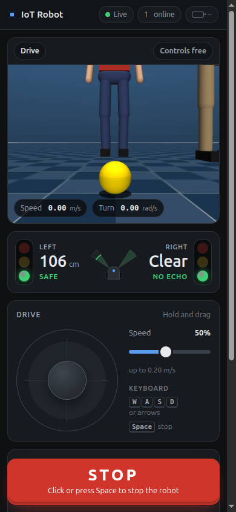

# Browser controller (iot_robot_web)

A single web page, served by the robot itself, that lets anyone on the same network drive the
robot, watch the camera, see both ultrasonic distances as traffic lights, switch between manual
driving and the follow modes, and stop the robot. It works on phones (portrait and landscape),
tablets and desktop browsers, and needs no app or install.

## Running it

### In the simulator

```bash
pixi run sim     # terminal 1: MuJoCo, controllers, twist_mux, ultrasonic ranges
pixi run web     # terminal 2: the web controller with use_sim_time:=true
```

Open <http://localhost:8080>. Other devices on the same network can use
`http://<this computer's IP>:8080`.

### On the robot

`robot.launch.py` starts the web controller by default:

```bash
pixi run -e robot robot            # includes the web page
pixi run -e robot robot web:=false # without it
```

It can also run on its own, for example on another port:

```bash
pixi run -e robot ros2 launch iot_robot_web web.launch.py port:=8081
```

| Launch argument | Default | Meaning |
| --- | --- | --- |
| `use_sim_time` | `false` | `true` in the simulator |
| `port` | `8080` | TCP port of the page |

### Finding the Pi's address

- **Hostname:** `http://<hostname>.local:8080`, for example `http://iot-robot.local:8080`. This
  uses mDNS, which Raspberry Pi OS and Ubuntu provide through `avahi-daemon`. iOS, macOS,
  Windows 10+ and most Linux desktops resolve `.local` names; some Android phones do not.
- **IP address:** run `hostname -I` on the Pi, or look the Pi up in the router's list of
  connected devices. Then open `http://<ip>:8080`.
- **Log line:** at start-up the node prints both forms, e.g.
  `Web controller on http://0.0.0.0:8080, on the LAN as http://iot-robot.local:8080`.
- **Firewall:** if `ufw` is enabled on the Pi, allow the port with `sudo ufw allow 8080/tcp`.

## Using the page

| Control | What it does |
| --- | --- |
| **STOP** | Tap, click, or press Space or Escape: engages the E-stop at once, for every browser. To release it, press and hold the button for 1 s (or hold Enter/Space while it has focus). A short press never releases. If the page is offline, a STOP press is kept and sent as soon as the connection returns; the page says so, and warns if the robot does not confirm a stop within 1.5 s. |
| **Joystick** | Drag the knob. Up drives forward, sideways turns; the further from the centre, the faster. Letting go stops the robot. |
| **Keyboard** | W A S D or the arrow keys, on computers only. Space is the E-stop. |
| **Speed slider** | 10 to 100 % of the maximum speed (0.4 m/s, 1.5 rad/s). Each browser remembers its own setting. |
| **Turbo** | Lets the speed slider go up to 300 % (1.2 m/s, 4.5 rad/s; `turbo_speed`). Turbo always starts off, turning it off drops the slider back to 100 %, and a reload never restores a turbo speed. |
| **Mode** | Drive, Follow ball or Follow person. The status line shows starting, running or failed (with the last line the follower printed). |
| **Camera aim** | Drive mode only. Drag the dot to pan left/right and tilt up; Centre levels the camera. |
| **Follow person** | Raise both hands for 2 s in front of the robot to enroll, or press "Enroll person in view" to enroll the person nearest the image centre. Forget clears the enrolled person. |

The **ultrasonic lights** show each sensor separately:

| Light | Distance (defaults) |
| --- | --- |
| Green, blinking once a second | 1.0 m or more. "Clear / No echo" when nothing is within the 4 m range. |
| Yellow, blinking faster | 0.4 m to 1.0 m |
| Red, blinking fastest | Below 0.4 m, up to 5 blinks per second at contact |
| Grey "No data" | No valid reading for 1 s, a sensor the STM32 reports as faulty (published as `NaN`, shown at once), or the page lost its connection |

The exact rule: green at or above `warn_distance`, yellow from `danger_distance` up to
`warn_distance`, red below `danger_distance`. The blink period falls linearly from 1.0 s at
`warn_distance` to 0.2 s at 0 m. Lamps dim rather than switch off, which keeps the flashing
within common photosensitivity guidance, and with the operating system's "reduce motion"
setting they pulse gently instead of blinking.

Below `obstacle_stop_distance` (0.25 m) on either sensor the server refuses forward motion from
the page: a red banner appears, the forward half of the joystick turns red, and reversing or
turning still works. A grey side blocks forward motion the same way ("No data from the left
sensor"), because nothing is watching that side. Set `require_ultrasonic: false` to drive
without the STM32 on the bench; the guard then uses whichever side still reports.

Faster commands are refused further out, because the robot needs room to stop: the stop
distance grows by `speed × obstacle_reaction_time + speed² / (2 × obstacle_deceleration)`.
With the defaults, it is 0.37 m at 0.4 m/s (100 %) and 0.85 m at 1.2 m/s (full turbo). Slowing
down, with the slider or the joystick, lets the robot creep closer again, down to 0.25 m.

The **top bar** shows the connection, whether wheel odometry is arriving ("Base"), how many
browsers are connected, and the battery voltage and charge once the STM32 reports it. The
**video bar** above the image shows the mode and who is driving. It sits outside the image so it
never covers the detectors' annotations, such as the person detector's status line in the top
left corner.

### Sharing the robot

- One person drives at a time. The first browser to use the joystick, keyboard or camera aim
  gets the controls. Everyone else sees "Someone else is driving" and a locked joystick.
- The driver keeps the controls for 2 s after letting go, so a short pause does not hand the
  robot to someone else. Closing the tab frees them immediately.
- Switching modes and enrolling are also refused while someone else is driving.
- The E-stop is shared: anyone can engage it, and anyone can release it. Every page shows a
  notice when someone else engages or releases it, including another ROS node publishing on
  `/e_stop` (see [Safety and security](#safety-and-security)).

### Driving during a follow mode

The joystick overrides the followers: twist_mux gives `cmd_vel/web` priority 90 and
`cmd_vel/follower` priority 10. About 0.5 s after the joystick is released the follower takes
over again. While the E-stop is engaged the follower keeps running, but twist_mux blocks its
commands.

After Forget, the person follower may turn in place for up to `search_timeout` (10 s) while it
searches. Switch to Drive to stop it.

A follower started outside the page (`pixi run follow`, `pixi run follow-person`) is not
stopped by the page. While one is running, Drive mode says so in its status line: the joystick
still overrides it, but it drives the robot again as soon as the joystick is released. Stop it
in the terminal it was started from.

## Safety and security

- **There is no login.** Anyone who can reach port 8080 can drive the robot and watch the
  camera. Run it only on a network you trust (home Wi-Fi, a dedicated hotspot) and never
  forward the port to the Internet. Traffic is plain HTTP, so other devices on the network can
  see the video.
- **The web E-stop is a software stop.** It publishes `/e_stop`, which locks twist_mux at
  priority 255, after sending a zero command. It depends on ROS, Wi-Fi and the browser all
  working. Keep the robot's physical power switch within reach.
- **The web E-stop stops the wheels only.** The page refuses camera aim while it is engaged
  ("Release the E-stop first"), but a follow mode keeps aiming the camera. On the real robot
  the hardware E-stop S1 cuts power to all four motors, and the robot software must then be
  restarted with the gizmo at its zero pose ([checklist.md](checklist.md#during-use)).
- **`/e_stop` is shared with other nodes.** twist_mux applies the latest `/e_stop` message
  from any publisher (the lock has no timeout), so the web node treats the topic as shared
  state rather than its own:
  - It subscribes to `/e_stop`. A stop or release published by another node (a hardware
    button, `ros2 topic pub /e_stop std_msgs/msg/Bool "{data: true}"`) is shown on every page
    and can be released there.
  - Engaging from the page publishes `true` and repeats it once a second while the stop is
    engaged, so a restarted twist_mux locks again. Releasing publishes a single `false`.
  - It never publishes `false` on a timer, so it does not cancel a stop that another node
    holds.
- **The E-stop state is not saved.** At start the web node listens on `/e_stop` for 1.5 s. A
  stop that another node keeps repeating (another web controller, for example) is heard and
  shown. If nothing is heard, the node publishes a single `false`, so a restart releases a stop
  that nobody repeats, including a one-off `ros2 topic pub --once` sent before the start.
  With `start_estopped` the node engages the E-stop at every start instead. `robot.launch.py`
  sets it (launch argument `start_estopped:=true`), so the real robot always starts stopped
  and someone has to release the stop on the page first; the simulation starts released.
- **Dead-man behaviour.** A browser sends drive commands 20 times a second while a control is
  held. The server stops publishing after 0.3 s without one and sends a single zero. If the
  web node dies, twist_mux times the input out after 0.5 s and the diff drive controller stops
  the wheels after its own `cmd_vel_timeout` (0.5 s). A follow launch started from the page
  receives SIGINT from the kernel when the web node dies, even from `kill -9`, and stops its
  nodes, so no follower is left driving the robot.
- **The server enforces every limit.** The page only asks. The server clamps speeds and gizmo
  angles, ignores malformed or non-finite numbers, applies the obstacle guard and the driver
  lock, and caps WebSocket messages at 4 KB.
- **Other websites cannot drive the robot through a visitor's browser.** Two checks work
  together:
  - The WebSocket is accepted only when its `Origin` matches the `Host` it connected to. This
    blocks cross-site WebSocket hijacking, where a page on another site opens a socket to the
    robot.
  - Every request (page, video and WebSocket) must name the robot in its `Host` header by an
    IP address, `localhost`, this machine's hostname, `<hostname>.local`, or a name listed in
    `allowed_hosts`. Anything else gets `421 Misdirected Request`. This blocks DNS rebinding,
    where an attacker's domain is re-pointed at the robot's IP address so that the attacker's
    page becomes same-origin with the robot and passes the `Origin` check.

  If the robot is reached through a name the router hands out (for example `robot.lan`), add
  that name to `allowed_hosts`. The page is served with a strict Content-Security-Policy and
  no inline scripts, and only the files in `static/` can be downloaded.

## Parameters

All parameters live in [`src/iot_robot_web/config/web_controller.yaml`](../src/iot_robot_web/config/web_controller.yaml).
Floats keep their decimal point, because ROS parameters are typed.

| Parameter | Default | Meaning |
| --- | --- | --- |
| `host` | `0.0.0.0` | Listen address. `0.0.0.0` means every interface, `127.0.0.1` only this computer |
| `port` | `8080` | TCP port (overridden by the launch argument) |
| `allowed_hosts` | unset | Extra host names the page may be opened under, e.g. `["robot.lan"]`. IP addresses, `localhost` and this machine's hostname (plain and `.local`) always work. `["*"]` accepts every name and turns off the DNS rebinding check |
| `telemetry_rate` | `10.0` | Hz, state pushed to each browser |
| `stream_fps` | `10.0` | MJPEG frame rate cap |
| `stream_width` | `640` | Wider frames are scaled down before JPEG encoding |
| `jpeg_quality` | `70` | JPEG quality, 0 to 100 |
| `max_linear` | `0.4` | m/s at full joystick and 100 % speed |
| `max_angular` | `1.5` | rad/s at full joystick and 100 % speed |
| `turbo_speed` | `3.0` | Highest speed slider value with Turbo on (3.0 = 300 %). `1.0` hides the button. `diff_drive_controller` clips anything above its own limits in `controllers.yaml` (1.2 m/s, 4.5 rad/s) |
| `publish_rate` | `20.0` | Hz on `/cmd_vel/web` while someone drives |
| `command_timeout` | `0.3` | s without a browser command before the robot stops |
| `driver_timeout` | `2.0` | s a driver keeps the controls after letting go |
| `start_estopped` | `false` | Engage the E-stop at every start. With `false` the node listens first and releases only a stop that nobody repeats. Set through the `start_estopped` launch argument; `robot.launch.py` passes `true` |
| `obstacle_stop_distance` | `0.25` | m, forward motion is refused below this, plus the braking distance at the commanded speed. `0.0` disables the guard |
| `obstacle_reaction_time` | `0.2` | s of sensor and command latency in the braking distance |
| `obstacle_deceleration` | `2.0` | m/s² braking in the braking distance. Keep it at or below the controller's `linear.x.max_deceleration` |
| `warn_distance` | `1.0` | m, yellow below this |
| `danger_distance` | `0.4` | m, red below this |
| `sensor_timeout` | `1.0` | s before a reading counts as stale ("No data") |
| `require_ultrasonic` | `true` | Block forward motion while a sensor is stale or faulty. `false` ignores such a side instead |
| `yaw_limit` | `0.785398` | rad, camera pan either side |
| `pitch_min` / `pitch_max` | `-0.785398` / `0.0` | rad, camera tilt range. Negative looks up |
| `battery_empty_voltage` | `21.0` | V shown as 0 % (6S LiPo at 3.5 V per cell) |
| `battery_full_voltage` | `25.2` | V shown as 100 % (4.2 V per cell) |
| `launch_package` | `iot_robot_behavior` | Package of the follow launch files |
| `ball_launch` / `person_launch` | `ball_follow.launch.py` / `person_follow.launch.py` | Follow launch files |
| `stop_timeout` | `10.0` | s to wait after SIGINT before killing a follow launch |
| `camera_topic` | `/camera/image_raw` | Video in Drive mode |
| `ball_image_topic` | `/ball/debug_image` | Video in Follow ball mode |
| `person_image_topic` | `/person/debug_image` | Video in Follow person mode |

## Architecture

```
 browsers                         web_controller (one process)
 ────────                         ───────────────────────────────────────────────────────────
 page ── WebSocket /ws ─────────► aiohttp on asyncio (main thread)
      ◄─ state 10 Hz ───────────   │  driver lock, E-stop, mode switching, follow processes
  ◄─ MJPEG /stream.mjpg ───   │  JPEG encoder thread, one encode per frame for all viewers
                                   ▼  thread-safe calls
                                  RobotBridge node (rclpy executor thread)
                                     publishes  /cmd_vel/web, /e_stop, /gizmo_controller/commands
                                     subscribes /ultrasonic/left, /ultrasonic/right,
                                                /diff_drive_controller/odom, /battery_state,
                                                /person/status, /e_stop,
                                                the camera or debug image
                                     calls      /person_detector/enroll, /person_detector/forget
                                  ros2 launch iot_robot_behavior <mode>_follow.launch.py
                                     (child process in its own session)
```

- **Two threads.** aiohttp runs on asyncio in the main thread; rclpy spins a
  `SingleThreadedExecutor` in a background thread. They share state through a lock and hand
  service results across with `call_soon_threadsafe`. Timers use the steady clock, so the
  dead-man and E-stop keep working even if `/clock` stops in the simulator.
- **WebSocket messages** are JSON. The page sends `drive` (joystick axes and speed fraction),
  `release`, `estop`, `gizmo`, `mode` and `person`. The server sends `hello` (limits and
  thresholds), `state` at 10 Hz, `notice` (refusals) and `result` (enroll and forget answers).
  The server pings every 5 s and drops a browser that does not answer.
- **No WebSocket compression.** The server declines permessage-deflate. With it, aiohttp 3.14
  closed the socket with 1002 (protocol error) when a browser's first frame was the pong to a
  heartbeat ping and its next one a compressed message: a visitor who watched the page for
  more than 5 s and then pressed STOP lost the stop. The messages are a few hundred bytes, so
  compression saved little. `test/test_websocket.py` guards against the regression.
- **The E-stop echo.** rclpy delivers the node's own `/e_stop` messages to its own
  subscription and does not say who published a message. The node therefore remembers the
  values it published in the last second and skips them when they come back, in order, so
  only other publishers' messages change the state.
- **Video.** `/stream.mjpg` is a `multipart/x-mixed-replace` response that browsers display in a
  plain ``. The image subscription exists only while at least one browser is watching, so
  the follow modes' debug images are rendered only when someone looks at them. The source
  follows the mode: the raw camera in Drive, the detector's annotated image in the follow modes.
- **Follow modes** are the same launch files as `pixi run follow` and
  `pixi run follow-person`, started with `ros2 launch` as a child process in its own session.
  Switching modes sends SIGINT, waits up to `stop_timeout`, then kills the whole process group,
  so no detector or follower is left behind. The mode is "running" once `/cmd_vel/follower` has
  a publisher (and, for person mode, once the enroll service is available). The child is
  started with `PR_SET_PDEATHSIG` set to SIGINT, so the kernel stops it if the web node dies
  without cleaning up (a crash or `kill -9`).

### Why not rosbridge and web_video_server

The usual ROS web stack is rosbridge (ROS topics over a WebSocket) plus web_video_server (MJPEG
of any image topic). It was not used here because:

- **Safety must live on the robot.** rosbridge lets any browser publish to any topic, including
  `/diff_drive_controller/cmd_vel` and `/e_stop`, which would bypass the speed limits, the
  obstacle guard and the driver lock. Those rules would need a separate node anyway, plus
  rosbridge's authentication extension to keep visitors away from the raw topics.
- **Starting and stopping launch files** (the follow modes) is not something rosbridge offers.
- **Fewer moving parts.** One Python process with aiohttp and OpenCV, both already in the pixi
  environment, replaces two extra servers that are not installed in it. The page is plain
  HTML, CSS and JavaScript with no build step and no CDN, so it works on a LAN without
  Internet access.
- **Bandwidth.** Each frame is encoded once and shared by every viewer, and nothing is
  subscribed while nobody watches.

## Development

```bash
# Unit tests (driver lock, command scaling, obstacle guard, light levels, E-stop echo filter,
# host check) and the WebSocket regression test
pixi run bash -c 'cd src/iot_robot_web && python -m pytest test'
# or through colcon
pixi run colcon test --packages-select iot_robot_web && pixi run colcon test-result --verbose
```

- The page lives in `src/iot_robot_web/static/`. With `--symlink-install` edits show up on the
  next reload. The server sends `Cache-Control: no-cache`, and open pages reload themselves when
  the web node restarts with changed files.
- The static files are served by an explicit handler rather than aiohttp's `add_static`, which
  refuses the symlinks that `--symlink-install` creates.
- `setup.cfg` disables the launch_testing pytest plugins, which fail to load under the pytest
  in the pixi environment and are not needed by these tests.

### Screenshots

Desktop (1440 × 900) and phone (390 × 844), taken in the simulator:




To take new ones, start the simulator and the web controller, open <http://localhost:8080> and
use the browser's device toolbar at the same sizes.

## Troubleshooting

| Symptom | Cause |
| --- | --- |
| "Waiting for video" | Nothing is publishing the mode's image topic. Check `ros2 topic hz /camera/image_raw`. |
| "Connection lost" banner | The web node stopped or the network dropped. The page reconnects by itself. |
| Mode shows "failed" | The follow launch exited. The status line shows its last output; the web node log shows the last 10 lines. |
| Lights stay grey | No valid `/ultrasonic/*` reading within `sensor_timeout`. On the robot, one grey side while the other works usually means the STM32 reports that sensor as faulty: the bridge logs `STM32: warning: <side> ...` and publishes `NaN` (see [hardware.md](hardware.md#stm32-sensor-board)). |
| Node exits at start with "Cannot listen on ..." | Another program uses the port. Pick another with `port:=`. |
| Battery shows "--" | The STM32 has not reported a voltage (or `/battery_state` is not published). |
| "Unknown host name" (HTTP 421) | The page was opened under a name the robot does not know, such as a router DNS name. Use the IP address or `<hostname>.local`, or add the name to `allowed_hosts`. The web node logs each refused name once. |
| "Someone engaged the E-stop" with nobody at a page | Another node published `true` on `/e_stop`. `ros2 topic info /e_stop --verbose` lists the publishers. |
| Drive mode says a follower started outside this page is running | A `pixi run follow` or `follow-person` is still running in a terminal. Stop it there. |
| Camera aim does nothing | The page shows why when it refuses: the E-stop is engaged, or a follow mode is active. Otherwise, on the robot: `gizmo_mode:=fixed` is set, or `gizmo_controller` is inactive after a gizmo fault or stall (`ros2 control list_controllers`). Put the gizmo at its zero pose and restart the robot software ([hardware.md](hardware.md#stopping-the-motors)). |
