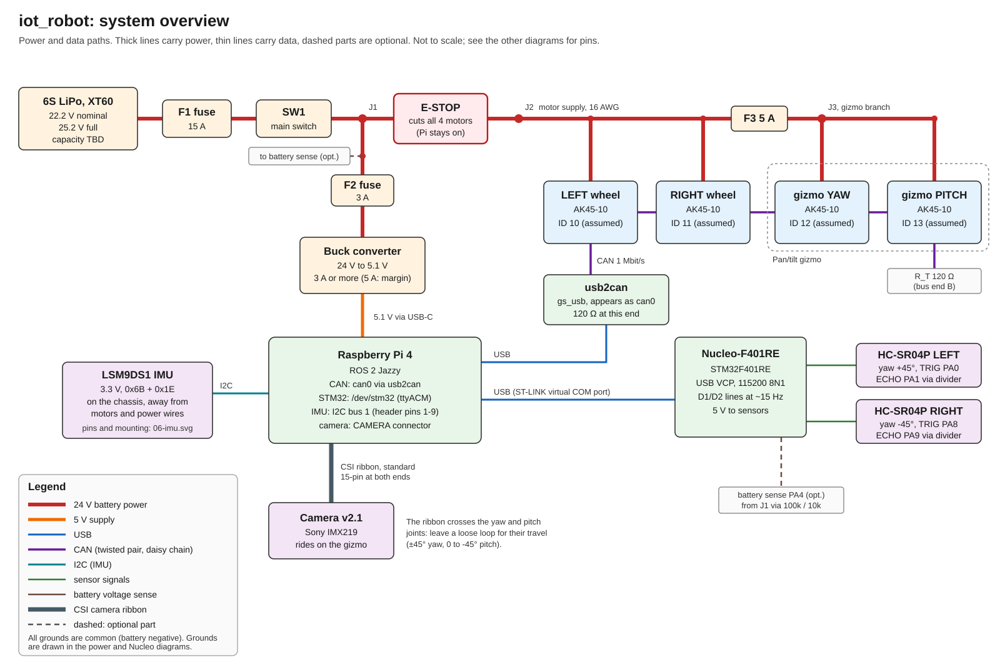
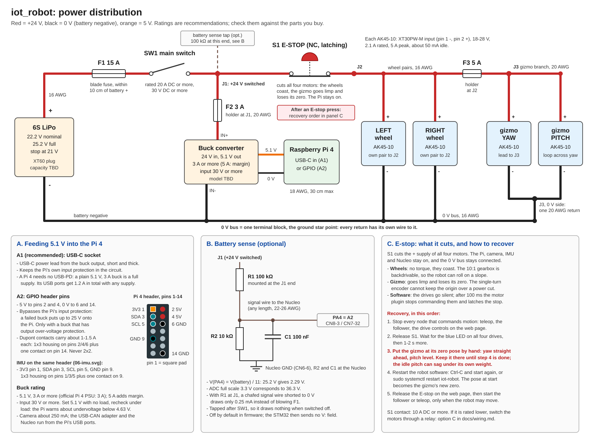
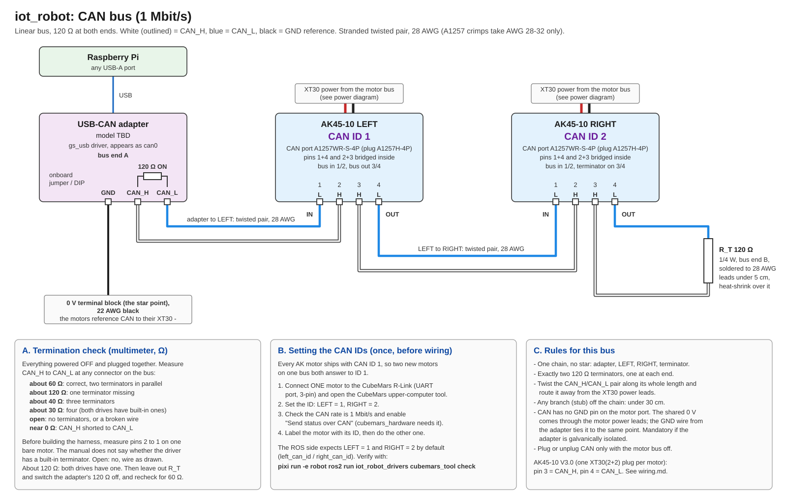
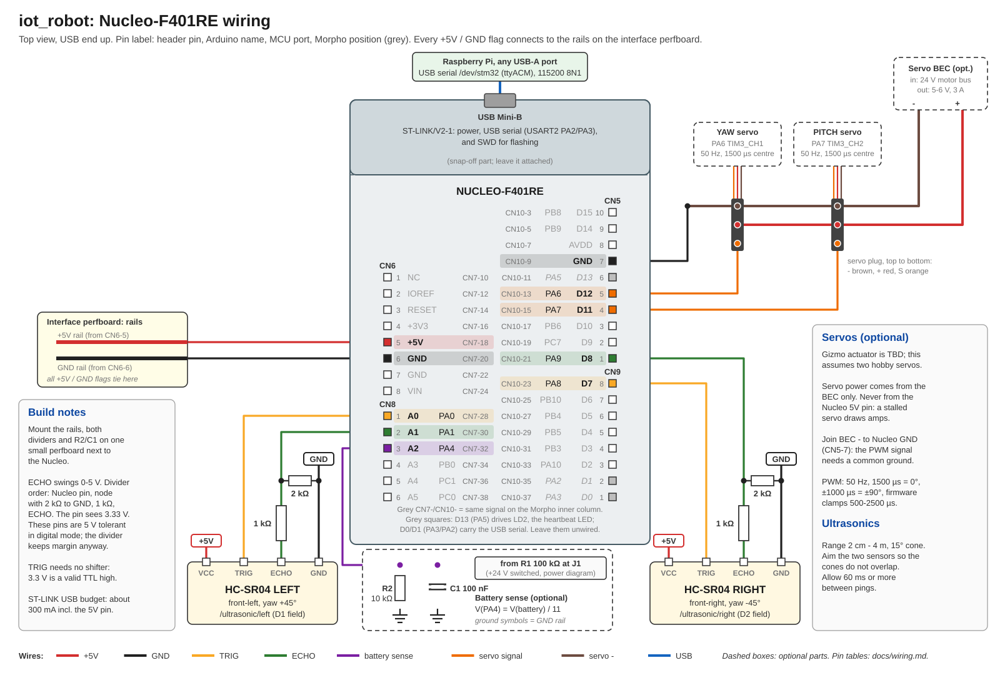
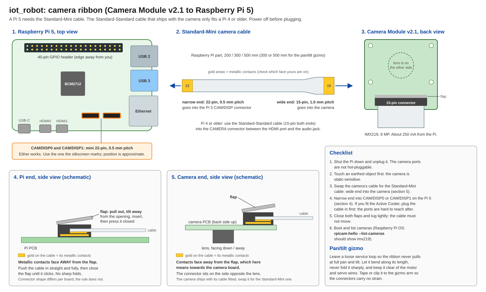
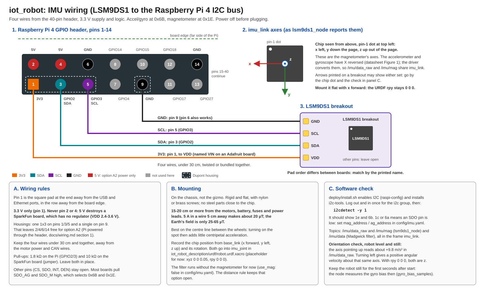

# iot_robot wiring

How to connect the iot_robot hardware: battery and power distribution, the four CAN
motors (two wheels and the gizmo's yaw and pitch), the Nucleo sensor board, the camera
and the IMU. Each section has a diagram and a pin-by-pin table with the same
connections. Where the two disagree, the table is the reference; please report the
mismatch.

The diagrams are SVG files in [`docs/wiring/`](wiring/). Open one in its own browser
tab to zoom in, or print it (landscape, fit to page).

The step-by-step list for bringing the robot up is [todo.md](todo.md), and the routine
for every session (power-on order, gizmo zero pose, E-stop recovery) is
[checklist.md](checklist.md).

> **Status.** Drawn from manufacturer datasheets and manuals (see [Sources](#sources)),
> not yet checked against the assembled robot. Items marked **TBD** or **assumed**
> are collected under [Open items](#open-items-tbd). Where an assumption changes the
> wiring, the section says what to do instead.

## Overview



- **Power.** One 6S LiPo (XT60 plug) powers everything. After the main fuse F1 and the
  main switch SW1, the switched +24 V (junction **J1**) splits two ways:
  - through the E-stop S1 to the **motor bus** (junction **J2**). Both wheel motors
    connect to J2 directly; the two gizmo motors connect through fuse F3 and the gizmo
    junction **J3**;
  - through fuse F2 to a **buck converter** that makes 5.1 V for the Raspberry Pi 4.

  The E-stop cuts all four motors. The Pi, the camera, the IMU and the Nucleo stay on.
- **Data.** The Raspberry Pi 4 talks to:
  - the four AK45-10 motors over CAN at 1 Mbit/s, through a native SocketCAN (gs_usb)
    USB-CAN adapter (`can0`);
  - the Nucleo-F401RE over the ST-LINK USB virtual COM port (115200 8N1). It shows up
    as `/dev/ttyACM<n>`; the udev rule in `deploy/udev/99-iot-robot-stm32.rules` adds
    the stable name `/dev/stm32`;
  - the Camera Module v2.1 over the CSI ribbon (CAMERA connector);
  - the LSM9DS1 IMU over I2C bus 1 (header pins 1, 3, 5 and 9).
- **Nucleo.** Reads two HC-SR04P ultrasonic sensors, and optionally the battery
  voltage. It only reads sensors and drives no motors.
- **Motor control.** The Raspberry Pi controls all four motors (both wheels and the
  gizmo's yaw and pitch) over CAN, through `ros2_control`.
- **Ground.** All grounds are common. Battery negative is the single 0 V reference.
  The star point is the **0 V terminal block** (or bus bar): battery negative, both
  wheel motor returns, the gizmo return from J3, the buck IN- and the CAN adapter GND
  each land on it with their own wire. Do not stack the motor returns on the buck's
  IN- screw terminal; that would push motor current through the buck's small terminal.

| Diagram | Content |
|---|---|
| [01-system-overview.svg](wiring/01-system-overview.svg) | Every part and the links between them |
| [02-power-distribution.svg](wiring/02-power-distribution.svg) | Battery, fuses, switch, E-stop, motor bus and gizmo branch, buck, Pi 4 feed, battery sense, E-stop recovery |
| [03-can-bus.svg](wiring/03-can-bus.svg) | USB-CAN adapter to the four motors, termination, CAN IDs and the joint mapping |
| [03-can-bus-harness.svg](wiring/03-can-bus-harness.svg) | The same CAN bus wire by wire (WireViz, wide; open separately) |
| [04-nucleo.svg](wiring/04-nucleo.svg) | Nucleo header pins to the ultrasonics and battery sense, 3.3 V sensor option |
| [05-camera-ribbon.svg](wiring/05-camera-ribbon.svg) | Camera ribbon on the Pi 4 and its orientation at both ends |
| [06-imu.svg](wiring/06-imu.svg) | LSM9DS1 IMU on the Pi 4 header, mounting and `imu_link` axes |

## Bill of materials

### Parts you have

| Part | Qty | Notes |
|---|---|---|
| CubeMars AK45-10 KV75 actuator | 4 | Original (V2.0) version: separate XT30 power and 4-pin CAN connectors. Set to CAN IDs 10 (gizmo yaw), 11 (gizmo pitch), 12 (left wheel) and 13 (right wheel), confirmed against the hardware on 2026-09-24, see [CAN IDs](#can-ids-and-the-joint-mapping). Each motor ships with a 16 AWG XT30 power lead and CAN plugs. |
| USB-CAN adapter ("usb2can") | 1 | Native SocketCAN (gs_usb), appears as `can0`. Check whether it has a built-in 120 Ω terminator and whether it is isolated, see [Termination check](#termination-check). |
| Raspberry Pi 4 | 1 | |
| Raspberry Pi Camera Module v2.1 (Sony IMX219) | 1 | Ships with a 150 mm Standard-Standard ribbon, which fits the Pi 4. |
| LSM9DS1 IMU breakout | 1 | Accelerometer, gyroscope and magnetometer on I2C |
| STM32 Nucleo-F401RE | 1 | Plus a USB-A to Mini-B cable. |
| HC-SR04P ultrasonic sensor | 2 | 3.3-5 V version of the HC-SR04, pins VCC / TRIG / ECHO / GND. |
| 6S LiPo battery | 1 | 22.2 V nominal, 25.2 V full, XT60 plug. Capacity **TBD**. |
| 24 V to 5 V buck converter | 1 | Model **TBD**, see [Feeding 5.1 V into the Pi](#feeding-51-v-into-the-pi). |
| Pan/tilt gizmo | 1 | Driven by two of the AK45-10 (yaw and pitch) on the CAN bus. |

### Parts you'll also need

| Part | Qty | Specification | Used for |
|---|---|---|---|
| Inline blade fuse holder | 3, or 4 with option C | ATO/ATC, 32 V DC. F1 with 16 AWG leads; F2 and F3 with 20 AWG; F4 with 22 AWG | F1, F2, F3; F4 only with relay K1 |
| Blade fuse 15 A | 1 + spares | ATO/ATC, 32 V DC | F1, main fuse at the battery |
| Blade fuse 5 A | 1 + spares | ATO/ATC, 32 V DC | F3, gizmo branch, at J2 |
| Blade fuse 3 A | 1 + spares | ATO/ATC, 32 V DC | F2, buck branch, at J1 |
| Blade fuse 1 A | 1 + spares | ATO/ATC, 32 V DC | F4, relay coil loop, only with option C |
| Main switch SW1 | 1 | 20 A DC or more at 30 V DC or more. It must have a **DC** rating; an AC rating alone does not count. | Turns the whole robot off |
| E-stop S1 | 1 | Latching mushroom head, NC contact rated 10 A DC or more at 24 V | Cuts all four motors |
| XT60 connector | 1 | Mates the battery's XT60 plug | Battery lead |
| AMASS XT30U-F / XT30UPB-F plug | 4 | Mates the drive's XT30PW-M socket | Motor power leads (one is supplied with each motor) |
| CJT A1257H-4P housing + A1257-TP crimp terminals | 8 | 1.25 mm pitch, 4-pin. The terminals take AWG 28-32 wire with insulation 1.0 mm OD or less [[a1257]], and need a fine-pitch crimp tool. | CAN plugs: one at each end of W2-W4, one on W1 and one on W5 (two are supplied with each motor) |
| Terminal blocks or lever connectors | 4 | J1, J2 and the 0 V bus: 20 A or more. J3: a 2-pole lever connector, 5 A or more | J1, J2, J3 and the 0 V bus (the star point) |
| 120 Ω resistor | 1, or 2 | 1/4 W | R_T at the PITCH motor; a second one at the adapter only if it has no terminator |
| 1 kΩ resistor | 2 | 1/4 W | ECHO dividers |
| 2 kΩ resistor | 2 | 1/4 W (2.2 kΩ also works: 3.44 V) | ECHO dividers (not needed with the [3.3 V option](#alternative-hc-sr04p-on-33-v)) |
| 100 kΩ and 10 kΩ resistor | 1 each | 1/4 W, 1 % metal film | Battery sense (optional) |
| 100 nF ceramic capacitor | 1 | 50 V | Battery sense filter (optional) |
| Perfboard | 1 | About 5 x 7 cm | Interface board: +5V/GND rails, dividers, R2/C1 |
| Dupont jumpers and housings | about 20 | Male pins fit the Nucleo's Arduino sockets; female fit the Morpho pins and the Pi header. For the Pi: one 1x3 housing and one single for the IMU, the same again for option A2 | Nucleo signals, IMU, Pi power option A2 |
| USB-C power lead or USB-C pigtail | 1 | 18 AWG or heavier, 30 cm or shorter | Buck output to the Pi (option A1) |
| Longer camera cable (if needed) | 1 | 15-pin, 1.0 mm pitch, 300 or 500 mm | Only if the supplied 150 mm ribbon does not reach the camera on the gizmo |
| Nylon or brass screws and standoffs | 4 | M2.5 or to suit the breakout | IMU mount, no steel near the magnetometer |
| LiPo voltage alarm (recommended) | 1 | Plugs into the balance lead | Warns before 3.5 V per cell |
| Cable ties, spiral wrap | - | - | Service loops across the gizmo joints |
| Heat-shrink, ferrules, crimp tool, multimeter | - | - | Assembly and checks |

Relay K1 and diode D1 are needed only for [option C](#e-stop-through-a-relay-option-c),
if S1's contact is rated below 10 A DC.

### Wire

| Run | Gauge | Colour |
|---|---|---|
| Battery, F1, SW1, J1, S1, J2, both wheel motors, and the 0 V bus | 16 AWG silicone | red (+) / black (0 V) |
| F3 to J3, J3 to both gizmo motors, and the gizmo return from J3 to the 0 V bus | 20 AWG silicone (flexible: it crosses the yaw joint) | red / black |
| F2 to the buck input | 20 AWG | red / black |
| Relay coil loop (option C, after F4) | 22 AWG | red / black |
| Buck output to the Pi | 18 AWG, 30 cm or shorter | red / black |
| CAN_H / CAN_L | 28 AWG **stranded**, twisted pair, insulation 1.0 mm OD or less (e.g. PTFE hook-up wire) | white / blue |
| CAN GND reference | 22 AWG | black |
| IMU (3V3, SDA, SCL, GND) | 24-26 AWG stranded, 30 cm or shorter | as in the IMU diagram |
| Nucleo rails, sensor and battery sense signals | 22-26 AWG | as in the Nucleo diagram |

- **Branch fuses sit at the source end of every thinner branch.** A short in a 20 or
  22 AWG lead can draw 10-15 A without blowing F1, and those wires cannot carry that for
  long. F2 and F4 mount directly at J1, F3 directly at J2, so no unfused thin wire
  leaves a junction.
- **The CAN wire gauge is set by the plug.** Every CAN wire ends in an A1257H-4P plug,
  and its crimp terminals take only AWG 28-32 [[a1257]]. The CAN lead supplied with the
  motors is 30 AWG [[akdrv]]. Do not use solid-core wire such as Cat5: it does not crimp
  reliably and breaks under vibration. If you want heavier wire for a longer run, keep
  a short pigtail of the supplied 30 AWG lead on each plug and splice it to the heavier
  stranded pair away from the connector.

## 1. Power distribution



- **F1 sits within 10 cm of battery +.** It protects the wiring, so nothing may
  connect between the battery and F1.
- **SW1 turns everything off. S1 cuts all four motors.** The wheel motors hang on J2
  directly and the gizmo branch (F3, J3) starts at J2, so the E-stop removes power from
  every motor. The Pi keeps running, logging and reachable, and the camera, IMU and
  Nucleo stay on.
- **The E-stop is a coast stop, not a brake.** An unpowered drive produces no torque,
  so the wheels roll out. The 10:1 planetary gearbox is backdrivable, so on a slope the
  robot can keep rolling. The gizmo goes limp, and the pitch axis can sag under the
  head's weight.
- **Every power cut costs the gizmo its zero.** The AK45-10 has a single-turn encoder
  and does not keep its output position over a power cut. The robot software sets a
  temporary origin on the gizmo motors when
  it starts (`zero_on_start` in `motors.yaml`; CubeMars servo mode "set origin",
  temporary [[tmcc]]). The pose at software start therefore becomes the zero, and the
  gizmo must be at its zero pose (yaw straight ahead, pitch level) whenever the robot
  software starts: at boot, after an E-stop, and after a service restart.
- The buck converter and the battery-sense tap connect at J1: after SW1 (so they
  draw nothing when the robot is off) and before S1 (so the E-stop does not cut
  them).
- The E-stop cuts only the + side. The 0 V bus stays connected, so CAN and sensor
  grounds keep their shared reference.

> **Warning: after an E-stop press, pose the gizmo and restart the robot software.
> Releasing the web E-stop afterwards can resume motion.** ROS cannot see the hardware
> E-stop directly. The robot uses the `cubemars_hardware_safe` plugin: when the drives
> lose power their status frames stop, and after 100 ms the plugin stops sending
> commands and latches that stop (see [Stopping the motors](hardware.md#stopping-the-motors)).
> Releasing S1 therefore does not move anything; the drives boot and receive nothing.
> Restarting the robot software clears the latch and takes the gizmo's pose at that
> moment as its new zero. `robot.launch.py` starts the web page with its E-stop engaged
> (`start_estopped:=true`, see [web.md](web.md#safety-and-security)), so the restarted
> robot stays still until someone releases the stop on the page. From then on, whatever
> is still commanding motion (the follower, teleop) drives the robot again. Recover in
> this order:
>
> 1. Stop every node that commands motion: close teleop, stop the follower, and release
>    the drive controls on the web page.
> 2. Release S1. Wait until the blue power LEDs of all four drives are on [[akdrv]],
>    then give them another second or two to boot.
> 3. Put the gizmo at its zero pose by hand: yaw straight ahead, pitch level. Hold or
>    prop it there until step 4 has finished, because the unpowered pitch axis can sag.
> 4. Restart the robot software: Ctrl-C and start again, or
>    `sudo systemctl restart iot-robot`. The pose at start becomes the gizmo's zero.
> 5. Release the E-stop on the web page, then start the follower or teleop again, only
>    when the robot may move.
>
> Possible improvement, not built: a second contact block on S1, read by a Nucleo input
> and reported by `stm32_bridge`, could latch `/e_stop` automatically. That needs
> firmware and driver changes as well as wiring.

### Power harness

| From | Pin | To | Pin | Wire | Notes |
|---|---|---|---|---|---|
| Battery | + (XT60) | F1 15 A | in | 16 AWG red | F1 within 10 cm of battery + |
| F1 | out | SW1 | in | 16 AWG red | |
| SW1 | out | J1 | - | 16 AWG red | J1: switched +24 V junction (terminal block) |
| J1 | - | S1 E-stop | NC contact, first terminal | 16 AWG red | NC contact terminals are usually numbered 11-12 or 21-22. Wiring with K1: see [option C](#e-stop-through-a-relay-option-c). |
| S1 E-stop | NC contact, second terminal | J2 | - | 16 AWG red | J2: +24 V motor bus junction |
| J2 | - | AK45-10 LEFT wheel | XT30PW-M pin 2 (+) | 16 AWG red | Use the supplied XT30 lead. Check polarity against the housing markings. |
| J2 | - | AK45-10 RIGHT wheel | XT30PW-M pin 2 (+) | 16 AWG red | As above |
| J2 | - | F3 5 A | in | - | Fuse holder mounted directly at J2 |
| F3 5 A | out | J3 | + side | 20 AWG red | J3: 2-pole lever connector at the gizmo base |
| J3 | + side | AK45-10 gizmo YAW | XT30PW-M pin 2 (+) | 20 AWG red | Or the supplied 16 AWG lead, shortened |
| J3 | + side | AK45-10 gizmo PITCH | XT30PW-M pin 2 (+) | 20 AWG red | Crosses the yaw joint: service loop |
| J1 | - | F2 3 A | in | - | Fuse holder mounted directly at J1, so the 20 AWG lead is fused from its first centimetre |
| F2 3 A | out | Buck converter | IN+ | 20 AWG red | |
| Battery | - (XT60) | 0 V bus | - | 16 AWG black | Terminal block or bus bar: the ground star point |
| 0 V bus | - | AK45-10 LEFT wheel | XT30PW-M pin 1 (-) | 16 AWG black | |
| 0 V bus | - | AK45-10 RIGHT wheel | XT30PW-M pin 1 (-) | 16 AWG black | |
| 0 V bus | - | J3 | 0 V side | 20 AWG black | One return for the whole gizmo branch |
| J3 | 0 V side | AK45-10 gizmo YAW | XT30PW-M pin 1 (-) | 20 AWG black | |
| J3 | 0 V side | AK45-10 gizmo PITCH | XT30PW-M pin 1 (-) | 20 AWG black | Runs with the PITCH + wire through the service loop |
| 0 V bus | - | Buck converter | IN- | 20 AWG black | Own wire from the block; the motor returns do not pass through the buck |
| 0 V bus | - | USB-CAN adapter | GND | 22 AWG black | See the [CAN harness](#can-harness) |
| Buck converter | OUT+ | Raspberry Pi 4 | USB-C VBUS (A1) or GPIO pins 2 and 4 (A2) | 18 AWG red | 30 cm or shorter. See [Feeding 5.1 V into the Pi](#feeding-51-v-into-the-pi). |
| Buck converter | OUT- | Raspberry Pi 4 | USB-C GND (A1) or GPIO pins 6 and 14 (A2) | 18 AWG black | |
| J1 | - | R1 100 kΩ | lead 1 | - | Optional battery sense. R1 is soldered at J1, see below. |
| R1 100 kΩ | lead 2 | Nucleo | CN8-3 (A2, PA4) | 22-26 AWG purple | R2 and C1 sit at the Nucleo end, see the [Nucleo table](#nucleo-connections) |

The XT30PW-M pin numbers (1 = -, 2 = +) are from the CubeMars AK driver manual
V1.0.18, section 1.2.3 [[akdrv]]. One CubeMars installation guide has a power
colour table that looks swapped [[ak40]]. Trust the "+" / "-" markings on the housing
and a multimeter, not the wire colour.

### Current budget and fuse sizing

| Load | Current from the battery | Source |
|---|---|---|
| AK45-10 wheel motor, each | 2.1 A rated, 5 A peak | [[ak45]] |
| AK45-10 gizmo motor, each | well under 1 A while holding or tracking; up to 5 A if stalled | [[ak45]], estimate |
| Four drives idle | about 0.2 A (about 50 mA each) | [[ak45]] |
| Buck for the Pi 4 (5.1 V x 3 A at about 90 % efficiency, 22 V in) | about 0.8 A | calculated |
| **Realistic peak** (both wheels at peak, gizmo moving) | **about 12-13 A** | |
| Theoretical worst case (all four motors at 5 A) | about 21 A | |

Treating the motor current ratings as battery current is conservative. At low speed
and high torque a drive draws much less from the battery than it drives through the
motor windings, because it steps the voltage down like a buck converter.

- **F1 stays at 15 A.** A blade fuse holds 110 % of its rating for at least 100 h and
  135 % for at least 0.75 s [[ato]]. The realistic peak never blows it, and the
  worst case (140 %) would only blow it if sustained. 20 A is the most that 16 AWG
  silicone wire should sit behind.
- **F2 at 3 A** covers the buck's worst case plus the inrush of its input capacitors.
- **F3 at 5 A** protects the 20 AWG gizmo branch. The gizmo normally draws under 1 A,
  and one stalled motor at 5 A (100 %) does not blow it. Both motors stalled (200 %)
  blow it in 0.15-5 s [[ato]]. A blown F3 cuts only the gizmo; the wheels keep power.
- **F4 at 1 A** (relay option only) covers a relay coil, which draws well under 0.5 A
  at 24 V.
- The drive board accepts 18-28 V [[akdrv]], so a 6S pack between 21 V and 25.2 V is
  within range.

Stop driving at about 21 V (3.5 V per cell). Below that, both the pack life and the
drives' input margin suffer. The optional battery sense or a balance-lead alarm
tells you when to stop.

### Feeding 5.1 V into the Pi

The Pi 4 needs 5.1 V; the official Pi 4 supply is 5.1 V, 3 A. The Pi logs an
undervoltage warning below 4.63 V [[rpipower]]. Set the buck output to 5.1 V with no
load connected, then check it again under load at the Pi end of the lead.

**Buck converter** (model **TBD**):

- Output 5.1 V, 3 A or more. 5 A adds margin and runs cooler.
- Input rated 30 V or more. A full 6S pack is 25.2 V, and motor braking can push the
  bus a little higher.
- Output over-voltage protection, if you use option A2.
- On the 5 V side: the camera takes about 250 mA [[rpipower]], and the USB-CAN adapter
  and the Nucleo with its sensors an estimated 0.2-0.3 A from the Pi's USB ports. A
  Pi 4 gives its USB ports 1.2 A in total with any supply [[rpipower]].

**Option A1 (recommended): USB-C socket.**
- Run a short, thick USB-C power lead from the buck output (a buck with a USB-C
  output, or a USB-C pigtail).
- This keeps the Pi's own input protection in the circuit.
- A Pi 4 does not use USB-PD, so a plain 5.1 V, 3 A buck is a full supply.

**Option A2: GPIO header pins.**
- Connect 5.1 V to pins 2 and 4 and 0 V to pins 6 and 14.
- This bypasses the Pi's input protection [[bret]]: a failed buck can put up to 25 V
  straight onto the Pi. Use it only with a buck that has output over-voltage
  protection.
- One Dupont contact carries only about 1-1.5 A, so both 5 V pins together are good
  for about 3 A. That matches a Pi 4.
- Use crimped housings, not loose jumpers: a **1x3 housing on pins 2, 4 and 6**
  (5 V, 5 V, GND) plus a single contact on pin 14 (GND). Pins 2, 4 and 6 are
  neighbours in the even row, and pin 14 is four positions further along. Do not use a
  2x2 housing: it also covers odd-row pins (1/3 = 3V3/SDA or 3/5 = SDA/SCL, which the
  IMU uses), and 5.1 V or 0 V landing there can short the 3V3 rail or destroy the IMU.
- The IMU's housings (1x3 on pins 1/3/5, single on pin 9, see
  [section 5](#5-imu-lsm9ds1)) sit next to these without sharing a housing.

**Alternative, not fitted: Raspberry Pi 5.** A Pi 5 needs a 5.1 V, 5 A buck. A plain
buck does not negotiate USB-PD, so the Pi 5 then limits its USB ports to 600 mA until
you set `PSU_MAX_CURRENT=5000` in its bootloader EEPROM [[rpieeprom]]. It also needs
the Standard-Mini camera cable [[rpicable]].

### Battery sense (optional)

A 100 kΩ / 10 kΩ divider scales the battery voltage for the Nucleo ADC on PA4:

- V(PA4) = V(battery) x 10 / (100 + 10) = V(battery) / 11
- Full pack, 25.2 V: PA4 sees 2.29 V. The ADC full scale of 3.3 V corresponds to 36.3 V.
- **R1 (100 kΩ) sits at the J1 end.** If the long signal wire chafes through to 0 V,
  only 0.25 mA flows and F1 does not blow.
- **R2 (10 kΩ) and C1 (100 nF) sit at the Nucleo.** C1 gives the ADC a low-impedance
  source for its sampling capacitor and filters motor noise.
- The tap is after SW1, so it draws nothing while the robot is off.
- Battery sensing is off by default in the firmware. The Nucleo then sends no `V:`
  field.

### E-stop through a relay (option C)

Only for an E-stop whose contact is rated below 10 A DC. Many panel E-stops list a
high AC rating and a much lower DC rating, so check the DC figure. With a relay, S1
switches only the coil current; K1 is a 24 V coil relay with contacts rated 20 A DC or
more (e.g. a 24 V automotive relay rated at 28 V DC), and D1 is a 1N4007 flyback diode.

| From | Pin | To | Pin | Wire | Notes |
|---|---|---|---|---|---|
| J1 | - | K1 | contact common (30 on an automotive relay) | 16 AWG red | |
| K1 | NO contact (87) | J2 | - | 16 AWG red | Replaces the S1-to-J2 link |
| J1 | - | F4 1 A | in | - | Fuse holder mounted directly at J1 |
| F4 1 A | out | S1 E-stop | NC contact, first terminal | 22 AWG red | Coil current only |
| S1 E-stop | NC contact, second terminal | K1 | coil + (86) | 22 AWG red | |
| K1 | coil - (85) | 0 V bus | - | 22 AWG black | |
| D1 1N4007 | cathode (stripe) | K1 | coil + (86) | - | Solder across the coil terminals |
| D1 1N4007 | anode | K1 | coil - (85) | - | |

Pressing S1 releases K1 and all four motors lose power, exactly as with S1 in the
line. Follow the same recovery order, gizmo zero pose included
([warning above](#1-power-distribution)).

With either option, closing the motor bus charges the drives' input capacitors. Expect
a small spark at the XT30 or at the contact.

## 2. CAN bus



The bus is one line at 1 Mbit/s: adapter, LEFT wheel, RIGHT wheel, gizmo YAW, gizmo
PITCH, terminator. It has a 120 Ω terminator at each physical end: at the adapter
(bus end A, on the chassis) and on the PITCH motor's free port (bus end B, on the
gizmo). The wire-by-wire view is
[03-can-bus-harness.svg](wiring/03-can-bus-harness.svg). It is generated with WireViz
and is wide, so open it in its own tab.

The original AK45-10 CAN port is a CJT A1257WR-S-4P [[akdrv]]:

| AK45-10 CAN pin | Signal |
|---|---|
| 1 | CAN_L |
| 2 | CAN_H |
| 3 | CAN_H (bridged to pin 2 inside the drive) |
| 4 | CAN_L (bridged to pin 1 inside the drive) |

Because the pairs are bridged, the bus passes through each motor. Use the same rule
on all four motors: **bus in on pins 1/2, bus out on pins 3/4**. The last motor
(PITCH) carries R_T on its out pins.

### CAN harness

| From | Pin | To | Pin | Wire | Notes |
|---|---|---|---|---|---|
| Raspberry Pi 4 | any USB-A port | USB-CAN adapter | USB | USB cable | gs_usb adapters appear as `can0` |
| USB-CAN adapter | CAN_H | AK45-10 LEFT wheel | 2 (CAN_H) | W1: 28 AWG stranded white, twisted with CAN_L | Bus in. Bus end A: the adapter's 120 Ω terminator **ON** (built in, or fit one), see [Termination check](#termination-check) |
| USB-CAN adapter | CAN_L | AK45-10 LEFT wheel | 1 (CAN_L) | W1: 28 AWG stranded blue | |
| AK45-10 LEFT wheel | 3 (CAN_H) | AK45-10 RIGHT wheel | 2 (CAN_H) | W2: 28 AWG stranded white, twisted with CAN_L | Out on 3, in on 2: the pair crosses over. This is intended. |
| AK45-10 LEFT wheel | 4 (CAN_L) | AK45-10 RIGHT wheel | 1 (CAN_L) | W2: 28 AWG stranded blue | |
| AK45-10 RIGHT wheel | 3 (CAN_H) | AK45-10 gizmo YAW | 2 (CAN_H) | W3: 28 AWG stranded white, twisted with CAN_L | From the chassis up to the gizmo base |
| AK45-10 RIGHT wheel | 4 (CAN_L) | AK45-10 gizmo YAW | 1 (CAN_L) | W3: 28 AWG stranded blue | |
| AK45-10 gizmo YAW | 3 (CAN_H) | AK45-10 gizmo PITCH | 2 (CAN_H) | W4: 28 AWG stranded white, twisted with CAN_L | Crosses the yaw joint (±45°, no slip ring): service loop, tied down on both sides |
| AK45-10 gizmo YAW | 4 (CAN_L) | AK45-10 gizmo PITCH | 1 (CAN_L) | W4: 28 AWG stranded blue | |
| AK45-10 gizmo PITCH | 3 (CAN_H) | R_T 120 Ω | lead 1 | W5: 28 AWG white, under 5 cm | Bus end B. The resistor's own leads are too thick for the A1257 terminal: crimp short 28 AWG leads into the plug, solder R_T to them and heat-shrink over it. |
| AK45-10 gizmo PITCH | 4 (CAN_L) | R_T 120 Ω | lead 2 | W5: 28 AWG blue, under 5 cm | |
| USB-CAN adapter | GND | 0 V bus (terminal block) | - | W0: 22 AWG black | The star point, on its own terminal. Required if the adapter is galvanically isolated; harmless otherwise. |

Match wires by pin number, not by colour. Colours of supplied leads vary between
manual versions. The CubeMars CAN lead in the accessory kit may populate only one
pair of its 4-pin plug. Check which pins it uses with a multimeter before building
with it.

If your adapter has a DB9 connector (for example Inno-maker USB2CAN), the pinout
follows CiA 303-1 [[inno]]:

| DB9 pin | Signal |
|---|---|
| 2 | CAN_L |
| 3 | GND |
| 7 | CAN_H |

### Termination check

Do this with everything powered **off** and plugged together. Measure the resistance
between CAN_H and CAN_L at any connector [[kvaser]]. Unpowered transceivers are high
impedance, so the meter sees only the terminators: two 120 Ω resistors in parallel
read 60 Ω.

| Reading | Meaning |
|---|---|
| about 60 Ω | Correct: two 120 Ω terminators in parallel |
| about 120 Ω | One terminator missing (adapter terminator off or absent, or R_T not fitted) |
| about 40 Ω | Three terminators |
| about 30 Ω / 24 Ω | Four / five terminators: the drives have built-in ones, see below |
| open | No terminator, or a broken wire |
| near 0 Ω | CAN_H shorted to CAN_L |

CubeMars documents no built-in terminator in the AK drives, and its FAQ lists a
missing 120 Ω terminator as a cause of CAN communication failures [[cmfaq]]. Measure
each part alone before building the harness:

- **Bare motor, pin 2 to pin 1:** kΩ or open means no built-in terminator (expected).
  About 120 Ω means it has one, and so do the other three.
- **Bare adapter, CAN_H to CAN_L, unplugged from USB:** about 120 Ω means its
  terminator is on. Open means it has none or it is switched off: switch it on, or fit
  a 120 Ω resistor across its CAN_H and CAN_L terminals.

If the motors do have built-in terminators, the four of them alone load the bus to
about 30 Ω (20 Ω with R_T and the adapter's), well below the 60 Ω the transceivers
are designed for. Do not drive like that; ask CubeMars whether the terminator can be
disabled.

### CAN IDs and the joint mapping

The four motors are set to CAN IDs **10, 11, 12 and 13**, at 1 Mbit/s. Which ID sits on
which joint was **confirmed against the hardware on 2026-09-24**:

| CAN ID | Joint | Place in the daisy chain |
|---|---|---|
| 10 | `gizmo_yaw_joint` | third |
| 11 | `gizmo_pitch_joint` | fourth (bus end B, carries R_T) |
| 12 | `wheel_joint_left` | first, next to the adapter |
| 13 | `wheel_joint_right` | second |

The wiring does not depend on the mapping: every motor sees the whole bus, so any
motor can sit anywhere in the chain. The chain order above is only how this robot is
built. The mapping lives in one file,
`src/iot_robot_bringup/config/motors.yaml`, keyed by URDF joint name, together with
each motor's direction. `robot.launch.py`, `cubemars_tool` and the systemd stop step
all read it. Moving a motor to another place in the chain needs no software change;
moving it to another joint needs `motors.yaml`.

Re-check the mapping whenever a motor is replaced or given a new ID, with the robot
software stopped, the wheels off the ground and the gizmo free to move:

```bash
pixi run -e robot can-identify            # asks which joint moved, prints the mapping
pixi run -e robot can-identify --write    # the same, then saves the CAN IDs to motors.yaml
```

`can-identify` runs `cubemars_tool identify`. Each motor in turn moves about 5° out
and back twice, then goes limp, and the tool asks which joint moved. It refuses to run
while another program is commanding the motors. `--degrees` (default 5), `--repeat`
(default 2) and `--max-current` (default 1.5 A) change the test move. Afterwards,
check each joint's direction with `cubemars_tool jog --joint <name>`; see
[todo.md](todo.md).

**Setting or changing an ID** (a new or replaced motor). New motors ship with CAN
ID 1, so set the ID before the motor joins the bus, one motor at a time [[akdrv]],
[[cmguide]]:

1. Connect the motor alone to a CubeMars R-Link on its UART port (3-pin: 1 GND, 2 TX,
   3 RX) and open the CubeMars Upper Computer. Connect to the R-Link's COM port at
   **921600 baud**. That is the serial link between the PC and the R-Link, not the CAN
   bitrate.
2. Set the CAN ID. Keep IDs unique on the bus.
3. Leave the CAN rate at 1 Mbit/s and enable "Send status over CAN".
   `cubemars_hardware` relies on the status frames [[cmhw]].
4. Label the motor with its ID, then update `motors.yaml`, or run
   `can-identify --write` once all motors are on the bus.

Direction is a `motors.yaml` setting, not a wiring change: the drive commutates
internally, so swapping motor leads cannot reverse it. Unlike the CAN IDs, the four
`direction` values in the file are still assumptions: confirm each one with
`cubemars_tool jog --joint <name>` ([todo.md](todo.md#units-and-direction)).

### Bringing up can0

On the robot, `deploy/network/80-iot-robot-can0.network` configures `can0` at 1 Mbit/s
through systemd-networkd whenever a gs_usb adapter appears. By hand, the command is
the one from the `cubemars_hardware` README [[cmhw]]. The Pi has no system ROS
install: ROS commands run inside the pixi environment `robot`, so they need the
`pixi run -e robot` prefix (see [hardware.md](hardware.md#ros-environment)).

```bash
sudo ip link set can0 up type can bitrate 1000000   # or: pixi run -e robot can-up
ip -details link show can0      # expect "bitrate 1000000", state ERROR-ACTIVE
pixi run -e robot can-check     # every motor in motors.yaml reporting
pixi run -e robot can-watch     # live position, speed, current, temperature and faults
```

`can-watch` runs `cubemars_tool watch`; the older name `cubemars_tool monitor` still
works.

### Rules for this bus

- One chain, no star: adapter, LEFT, RIGHT, YAW, PITCH, R_T.
- Exactly two 120 Ω terminators, one at each physical end: the adapter and the PITCH
  motor.
- Twist CAN_H and CAN_L together along the whole length. Route the pair away from the
  XT30 power leads.
- Keep any branch (stub) off the chain under 30 cm.
- W4, the PITCH power pair and the camera ribbon cross the yaw joint, which turns ±45°
  with no slip ring. Leave a service loop and tie the bundle down on both sides of the
  joint, so the plugs carry no strain. Turn the gizmo by hand to both limits to check
  that nothing pulls or snags.
- The motor CAN port has no GND pin. The drives reference CAN to their XT30 power
  negative. The adapter's GND wire ties the adapter to the same 0 V, at the 0 V
  terminal block.
- Every wire into an A1257H-4P plug is 28 AWG stranded, or the supplied 30 AWG lead
  (see [Wire](#wire)).
- Plug or unplug CAN only with the motor supply off.

### AK45-10 V3.0 variant

The motors on this robot are the original (V2.0) version drawn above. For reference,
if a replacement arrives as V3.0: it combines power and CAN in one XT30(2+2) socket
[[akv3]], [[ak45v3]]:

| XT30(2+2) pin | Signal |
|---|---|
| 1 | + (24 V) |
| 2 | - (0 V) |
| 3 | CAN_H |
| 4 | CAN_L |

Each V3.0 motor ships with a 100 mm pigtail: an XT30(2+2)-F plug at one end, stripped
and tinned wires at the other. With only one CAN pair per motor, the bus cannot pass
through the drive. Run the twisted pair past the motors in chain order and splice each
pigtail's CAN_H/CAN_L into it, which keeps each stub about 10 cm. End the chain with
R_T at the last splice. The power pins go to J2 or J3 and the 0 V bus exactly as in
the power table.

## 3. Nucleo-F401RE sensor board



The Nucleo reads the two ultrasonic sensors and, optionally, the battery voltage. It
drives no motors: the Raspberry Pi controls all four over CAN ([section 2](#2-can-bus)).

The Nucleo is powered and talks to the Pi over one USB cable: the ST-LINK Mini-B port
to any Pi USB-A port. Its USART2 (PA2/PA3) goes to the ST-LINK virtual COM port, and
the same port is used for flashing over SWD. Leave the ST-LINK part attached, and
leave jumper JP5 in its default U5V position (power from the ST-LINK USB) [[um1724]].

The interface perfboard carries a +5V rail and a GND rail, both fed from the Nucleo
header. It also holds the two ECHO dividers and R2/C1 of the battery sense. In the
diagram, every +5V or GND flag means "connect to that rail".

### Nucleo connections

Nucleo pins are given as `header-pin (Arduino name, MCU port)`. The Morpho column is
the same signal on the long male header (CN7/CN10), if you prefer female Dupont
leads there. Pin data: UM1724 Rev 17, Figure 17 and Tables 16 and 29 [[um1724]].

| From | Pin | To | Pin | Wire | Notes |
|---|---|---|---|---|---|
| Raspberry Pi 4 | any USB-A port | Nucleo ST-LINK | USB Mini-B | USB cable | Power + serial, `/dev/stm32`, 115200 8N1 |
| Nucleo | CN6-5 (+5V; Morpho CN7-18) | Perfboard | +5V rail | 22 AWG red | Sensor supply. Do not use CN10-8 (U5V). |
| Nucleo | CN6-6 (GND; Morpho CN7-20) | Perfboard | GND rail | 22 AWG black | |
| Perfboard | +5V rail | HC-SR04P LEFT | VCC | 24 AWG red | |
| Perfboard | GND rail | HC-SR04P LEFT | GND | 24 AWG black | |
| Nucleo | CN8-1 (A0, PA0; Morpho CN7-28) | HC-SR04P LEFT | TRIG | 24 AWG yellow | Direct: 3.3 V is a valid TTL high |
| HC-SR04P LEFT | ECHO | 1 kΩ (perfboard) | lead 1 | 24 AWG green | 0-5 V pulse |
| 1 kΩ (perfboard) | lead 2 = divider node | Nucleo | CN8-2 (A1, PA1; Morpho CN7-30) | 24 AWG green | 3.33 V high |
| Divider node LEFT | - | 2 kΩ | to GND rail | on perfboard | |
| Perfboard | +5V rail | HC-SR04P RIGHT | VCC | 24 AWG red | |
| Perfboard | GND rail | HC-SR04P RIGHT | GND | 24 AWG black | |
| Nucleo | CN9-8 (D7, PA8; Morpho CN10-23) | HC-SR04P RIGHT | TRIG | 24 AWG yellow | |
| HC-SR04P RIGHT | ECHO | 1 kΩ (perfboard) | lead 1 | 24 AWG green | |
| 1 kΩ (perfboard) | lead 2 = divider node | Nucleo | CN5-1 (D8, PA9; Morpho CN10-21) | 24 AWG green | |
| Divider node RIGHT | - | 2 kΩ | to GND rail | on perfboard | |
| R1 100 kΩ (at J1) | lead 2 | Nucleo | CN8-3 (A2, PA4; Morpho CN7-32) | 22-26 AWG purple | Optional battery sense, ADC1_IN4 |
| CN8-3 node | - | R2 10 kΩ | to GND rail | on perfboard | Optional |
| CN8-3 node | - | C1 100 nF | to GND rail | on perfboard | Optional |

Pins to leave unwired:

| Pin | Why |
|---|---|
| CN5-6 (D13, PA5) | Drives LD2, the firmware's heartbeat LED |
| CN9-1 / CN9-2 (D0 / D1, PA3 / PA2) | USART2 to the ST-LINK virtual COM port (solder bridges SB13/SB14) |
| CN6-8 (VIN), CN10-8 (U5V) | Power inputs/outputs of the board's own supply; feeding them fights the USB supply |

### Why the ECHO dividers

- The HC-SR04P's ECHO high equals its supply voltage: 5 V when it runs from the +5V
  rail as drawn. The STM32F401 runs at 3.3 V.
- The pins used here (PA0, PA1, PA4, PA8, PA9) are FT (5 V tolerant) in digital mode,
  but not in analog mode [[f401ds]]. The 1 kΩ / 2 kΩ divider (5 V x 2/3 = 3.33 V)
  keeps margin anyway, e.g. if firmware ever leaves a pin in analog mode.
- **The order matters.** Along the wire it is: Nucleo pin, divider node (2 kΩ to
  GND), 1 kΩ, sensor ECHO. If the 2 kΩ is joined on the sensor side of the 1 kΩ
  instead, it only loads the sensor output, and the pin gets the full 5 V pulse
  through the 1 kΩ.
- The input high threshold is 0.45 x VDD + 0.3 = 1.79 V at 3.3 V by design, and ST
  tests 0.7 x VDD = 2.31 V in production [[f401ds]]. 3.33 V is well above both.
- TRIG needs no level shifter. The sensor wants a 10 µs TTL pulse, and 3.3 V is a
  valid TTL high.

### Alternative: HC-SR04P on 3.3 V

The HC-SR04P also runs from 3.3 V [[hcsr04p]]. Its ECHO high is then 3.3 V, so it can
drive the Nucleo pin without a divider:

- Take VCC for both sensors from the Nucleo's +3V3 pin (CN6-4; Morpho CN7-16) instead
  of the +5V rail.
- Remove both 2 kΩ resistors. Each 1 kΩ may stay in the ECHO line as series
  protection.
- The Nucleo pins stay the same, so the firmware does not change.

The tradeoff: nothing to build and no 5 V signal anywhere near a 3.3 V pin, but the
range drops a little (sellers quote 4.5 m at 5 V and 4.0 m at 3.3 V), and the
sensors' 2 x 15 mA then comes from the Nucleo's 3.3 V regulator, which also feeds the
MCU. That is well within its rating. **Never keep the 2 kΩ at 3.3 V:** the divided
ECHO high falls to 2.2 V, below the 2.31 V (0.7 x VDD) that ST tests in production.

### Ultrasonic sensors

- HC-SR04P: 3.3-5 V, about 15 mA, 40 kHz, 2 cm to 4 m, 15° cone [[hcsr04p]]. Allow
  60 ms or more between pings [[hcsr04]]. The two sensors must be pinged one after
  the other, not at the same time, so neither hears the other's echo. That is a
  firmware requirement, not a wiring one.
- Mount LEFT at the front-left facing 45° outward, and RIGHT at the front-right facing
  45° outward. This matches `ultrasonic_left_link` and `ultrasonic_right_link` in the
  URDF (yaw +45° and -45°). They publish `/ultrasonic/left` (serial field `D1`) and
  `/ultrasonic/right` (`D2`).
- The ST-LINK USB budget is about 300 mA for the board and its 5V pin [[um1724]].
  Two sensors take about 30 mA.

## 4. Camera ribbon



All Raspberry Pi cameras use the standard 15-pin, 1.0 mm pitch connector, and so does
the Pi 4. Its CAMERA connector is "by the edge closest to you between the micro HDMI
connector and the audio jack" [[rpicam]]. The Standard-Standard cable that ships fitted
to the camera (150 mm) therefore fits both ends. Do not confuse CAMERA with DISPLAY,
the similar connector on the opposite short edge from the USB ports.

| From | Pin | To | Pin | Wire | Notes |
|---|---|---|---|---|---|
| Camera Module v2.1 | 15-pin CSI connector | Standard-Standard cable | one end | ribbon | Contacts face away from the flap, which means towards the camera board |
| Standard-Standard cable | other end | Raspberry Pi 4 | CAMERA | ribbon | Contacts face away from the flap: towards the HDMI ports. The blue stiffener faces the audio jack. |

The camera sits on the gizmo's pitch stage and the Pi on the chassis. Measure the path
with a loose loop at each joint; if 150 mm is too short, use a longer 15-pin, 1.0 mm
pitch camera cable (300 or 500 mm).

Procedure [[rpicam]]:

1. Shut the Pi down and disconnect its power. The camera ports are not hot-pluggable.
2. Earth yourself first. The camera is sensitive to static.
3. Open the connector flap: pull it out until it stops, then tilt it slightly away
   from the opening.
4. Insert the cable straight and fully, metallic contacts facing away from the flap.
   Push the flap back down until it clicks.
5. Do the same at the camera end if you changed the cable. The camera connector is on
   the side opposite the lens.
6. Boot and, with the robot software stopped, run `rpicam-hello --list-cameras`. It
   should list `imx219`.

The ribbon crosses the yaw and pitch joints. Leave a loose loop at each so it never
pulls at the limits, let it bend along its length, never fold it sharply, and keep it
clear of the motor power and CAN wires. Clip it to the gizmo so the connectors carry
no strain.

## 5. IMU (LSM9DS1)



The LSM9DS1 (accelerometer, gyroscope and magnetometer) sits on the Pi's I2C bus 1,
four wires from the 40-pin header. `lsm9ds1_node` publishes `/imu/data_raw` and
`/imu/mag` in the frame `imu_link`, and `imu_filter_madgwick` turns them into
`/imu/data`. Configuration: `iot_robot_bringup/config/imu.yaml`. `robot.launch.py`
starts both (launch argument `imu`, default true), and `launch/imu.launch.py` starts
them on their own.

| From | Pin | To | Pin | Wire | Notes |
|---|---|---|---|---|---|
| Raspberry Pi 4 | pin 1 (3V3) | LSM9DS1 | VDD (VIN on an Adafruit board) | 24-26 AWG | 3.3 V only. Never pin 2 or 4 (5 V). |
| Raspberry Pi 4 | pin 3 (GPIO2, SDA) | LSM9DS1 | SDA | 24-26 AWG | |
| Raspberry Pi 4 | pin 5 (GPIO3, SCL) | LSM9DS1 | SCL | 24-26 AWG | |
| Raspberry Pi 4 | pin 9 (GND) | LSM9DS1 | GND | 24-26 AWG | Pin 6 is GND too, but option A2 uses it |

Pin 1 is the square pad at the end of the header away from the USB and Ethernet ports,
in the row away from the board edge. The pad order on the breakout differs between
makers: match by the printed name, not by position. Leave the other breakout pins
(CS, SDO, INT, DEN) open.

**Addresses.** Accelerometer/gyroscope at **0x6B**, magnetometer at **0x1E**. Most
boards pull SDO_AG and SDO_M high; with a pin pulled low the address becomes 0x6A or
0x1C [[sfimu]]. Set `ag_address` and `mag_address` in `config/imu.yaml` to match.

**Wiring rules.**
- 3.3 V only. The SparkFun board has no regulator and its VDD range is 2.4-3.6 V
  [[sfimu]]; 5 V destroys it. The Adafruit board has its own regulator and names the
  pin VIN; 3.3 V works there too.
- Use a 1x3 Dupont housing on pins 1/3/5 and a single one on pin 9. That keeps pins
  2/4/6/14 free for [option A2](#feeding-51-v-into-the-pi).
- Keep the four wires under 30 cm, twisted or bundled together, and away from the
  motor power and CAN wires.
- Pull-ups: the Pi has fixed 1.8 kΩ pull-ups on GPIO2/3, and the SparkFun board adds
  10 kΩ (jumper) [[sfimu]]. Leave both; together they are about 1.5 kΩ, fine for I2C.

**Mounting.**
- On the chassis, not the gizmo. Rigid and flat, with nylon or brass screws; no steel
  parts close to the chip.
- **15-20 cm or more from the motors, the battery, the fuses and the power leads.** A
  wire carrying 5 A makes about 20 µT at 5 cm, against the Earth's field of
  25-65 µT. The filter runs without the magnetometer for now (`use_mag: false` in
  `imu.yaml`); the distance keeps that option open.
- Best on the centre line between the wheels: turning on the spot then adds little
  centripetal acceleration.

**Orientation and `imu_link`.** Record where the chip sits relative to `base_link`
(x forward, y left, z up) and how it is turned. Both go into the `imu_joint` origin in
`iot_robot_description/urdf/robot.urdf.xacro`, which is a placeholder for now
(xyz 0 0 0.05, rpy 0 0 0).

- The driver reports all three sensors in the magnetometer's axes, which are
  `imu_link`: with the chip seen from above and its pin-1 dot at the top left, x points
  left, y down the page and z up out of the chip. The accelerometer and gyroscope have
  X reversed relative to that (ST datasheet, Figure 1), so arrows printed on a breakout
  may show either set. Go by the chip dot and the check below.
- Mounted flat with that x pointing forward, the URDF rpy stays 0 0 0. Turned so that
  x points to the robot's left, it becomes rpy 0 0 1.5708.
- Check: with the robot level and still, the axis pointing up reads about +9.8 m/s² in
  `/imu/data_raw`. Turning the robot left gives a positive angular velocity about that
  same axis. With rpy 0 0 0, both show on z.

**Software.** `deploy/install.sh` enables I2C with `raspi-config` (it sets
`dtparam=i2c_arm=on`), installs `i2c-tools` and adds the user to the `i2c` group. By
hand: `sudo raspi-config nonint do_i2c 0` (0 means enable). Log out and back in once
for the group, then:

```bash
i2cdetect -y 1     # -y skips the confirmation prompt; bus 1 is header pins 3 and 5
```

It should show `1e` and `6b`. Keep the robot still for the first seconds after the
software starts: the node measures the gyroscope bias then (`gyro_bias_samples`).

## Safety checklist before first power-on

Work through this with the battery **disconnected** unless a step says otherwise.

**Wiring checks (no power)**

- [ ] Every XT30 and the XT60: + and - match the housing markings. Check with a
      multimeter, not by wire colour.
- [ ] F1 (15 A) is fitted within 10 cm of battery +. F2 (3 A) sits at J1 before the
      buck. F3 (5 A) sits at J2 and feeds J3, the gizmo branch. With relay K1 only:
      F4 (1 A) sits at J1 in the coil loop.
- [ ] The 0 V terminal block is the star point: battery negative, both wheel motor
      returns, the gizmo return from J3, the buck IN- and the CAN adapter GND each have
      their own wire to it.
- [ ] No short on any branch. Measure + to 0 V at J1, J2 and J3: the reading should
      start low and climb as the drive capacitors charge, not stay near 0 Ω.
- [ ] SW1 off: J1 is isolated from battery +.
- [ ] E-stop released: S1 conducts. Pressed: S1 is open and stays open (latching).
- [ ] CAN_H to CAN_L reads about 60 Ω with everything plugged together (see
      [Termination check](#termination-check)).
- [ ] Continuity between battery -, the buck IN-, the buck OUT-, the Nucleo GND and the
      CAN adapter GND wire.
- [ ] No Nucleo pin other than CN6-5 and CN6-6 (or CN6-4 with the 3.3 V sensor option)
      connects to a supply rail. CN6-8 (VIN) and CN10-8 (U5V) are unused.
- [ ] IMU on Pi pins 1, 3, 5 and 9. Nothing but the A2 feed on pins 2 and 4.
- [ ] Each motor is labelled with its CAN ID (10-13) and its joint: 10 gizmo yaw,
      11 gizmo pitch, 12 left wheel, 13 right wheel
      ([CAN IDs](#can-ids-and-the-joint-mapping)).
- [ ] Turn the gizmo by hand through both yaw limits and the full pitch range. The
      power leads, W4 and the camera ribbon follow without pulling or snagging.
- [ ] Camera ribbon seated at both ends with both flaps closed.

**First power, Pi disconnected**

- [ ] Connect the battery with SW1 off, then switch SW1 on with the E-stop **pressed**.
- [ ] Buck output measures 5.1 V with no load. Adjust before connecting the Pi.
- [ ] Optional battery sense: the voltage at the Nucleo end of R1/R2 is about
      V(battery) / 11 (2.29 V at 25.2 V) before you plug it into CN8-3.
- [ ] Switch SW1 off and connect the Pi.

**First power, everything connected**

- [ ] Wheels off the ground (robot on blocks), gizmo free to move, E-stop within reach.
- [ ] SW1 on with the E-stop pressed: the Pi boots and no undervoltage warning appears
      (`vcgencmd get_throttled` returns `throttled=0x0`).
- [ ] With the sensors on 5 V, the divider nodes (Nucleo CN8-2 and CN5-1) never exceed
      3.4 V.
- [ ] `i2cdetect -y 1` shows `1e` and `6b`.
- [ ] Release the E-stop: all four drive LEDs light blue. `pixi run -e robot can-check`
      finds IDs 10-13, and the motors do not move on their own.
- [ ] With the robot software not running, confirm the joint mapping still matches
      `motors.yaml`: `pixi run -e robot can-identify` (add `--write` if it differs).
      Do this before any jog by joint name: with a wrong mapping, a wheel command could
      go to a gizmo motor.
- [ ] Check each joint's direction with `cubemars_tool jog --joint <name>` (see
      [todo.md](todo.md)). Gizmo jogs are limited to 15° of travel.
- [ ] With the robot software not running, start a slow 20 s wheel jog:
      `pixi run -e robot ros2 run iot_robot_drivers cubemars_tool jog --joint wheel_joint_left --velocity 1.0 --duration 20`.
      Press the E-stop while the wheel turns: the wheel coasts to a stop, the gizmo goes
      limp and the Pi stays up. Keep S1 pressed until the jog command has exited, then
      release it. Nothing may move. Releasing S1 while the jog still runs would restart
      the wheel at once, which is the hazard described in the
      [E-stop warning](#1-power-distribution).
- [ ] Before the robot software starts for the first time, put the gizmo at its zero
      pose: yaw straight ahead, pitch level.

**Every session**

The routine for every session is in [checklist.md](checklist.md). In short: power on
with the E-stop pressed; put the gizmo at its zero pose before the robot software
starts; after any E-stop press, follow the [recovery order](#1-power-distribution);
press the E-stop and shut the Pi down (`sudo shutdown -h now`) before switching SW1
off; charge the LiPo with a balance charger, attended, and stop using it at 21 V.

## Open items (TBD)

| Item | Assumed here | What changes if different |
|---|---|---|
| Battery capacity | 6S LiPo with XT60, capacity unknown | Run time only; the wiring and fuses stay the same. Check that the pack's continuous rating (capacity x C rating) covers at least 15 A. |
| Motor directions | `direction` in `motors.yaml`: 1 for the left wheel and both gizmo joints, -1 for the right wheel | Still unchecked, unlike the CAN ID mapping. Nothing to rewire: check each joint with `cubemars_tool jog --joint <name>` and flip the ones that turn the wrong way, see [todo.md](todo.md#units-and-direction). |
| Built-in CAN terminator in the drives | None (CubeMars documents none) | If a bare drive reads about 120 Ω, four terminators load the bus to about 30 Ω. Ask CubeMars before driving. See [Termination check](#termination-check). |
| USB-CAN adapter terminator and isolation | Built-in 120 Ω, switched on; not isolated | No terminator: fit a 120 Ω at the adapter end. Isolated: the GND wire (drawn anyway) becomes mandatory. |
| Buck converter model | 5.1 V, 3 A or more, 30 V+ input, non-isolated; over-voltage protection only needed for option A2 | Under 3 A: undervoltage warnings under load. Input under 30 V: not safe on 6S. No over-voltage protection: use option A1 only. |
| Gizmo zero reference | Set by eye: yaw straight ahead, pitch level | A mechanical stop or alignment marks at the zero pose would make it repeatable; none is designed yet. |
| IMU position and orientation | URDF placeholder: xyz 0 0 0.05, rpy 0 0 0 | Measure and set the `imu_joint` origin once the IMU is mounted, see [section 5](#5-imu-lsm9ds1). |
| Camera cable length | The supplied 150 mm reaches the gizmo | Longer 15-pin, 1.0 mm pitch cable (300 or 500 mm) |
| Hardware E-stop feedback to ROS | None directly; the motor plugin latches a stop when the unpowered drives go silent | Possible later: a second contact block on S1 wired to a Nucleo input, reported by `stm32_bridge`, latching `/e_stop`. Needs firmware and driver support. |

## Regenerating the diagrams

| File | Source | How |
|---|---|---|
| `01-system-overview.svg`, `02-power-distribution.svg`, `03-can-bus.svg`, `05-camera-ribbon.svg`, `06-imu.svg` | Hand-written SVG | Edit the SVG directly |
| `04-nucleo.svg` | `docs/wiring/src/04-nucleo.py` (Python standard library only) | `python3 docs/wiring/src/04-nucleo.py` |
| `03-can-bus-harness.svg` | `docs/wiring/src/03-can-bus-harness.yml` (WireViz 0.4) | `uvx wireviz -f s -o docs/wiring docs/wiring/src/03-can-bus-harness.yml` |

- WireViz needs Graphviz (`dot`) on the PATH.
- `uvx` runs WireViz in a throwaway environment, so nothing is installed into the
  project.
- If you change a pin assignment, change it in the diagram, in this file, and in the
  STM32 firmware, `motors.yaml` or the launch arguments together.

To check a diagram for overlapping or clipped labels, render it to PNG with headless
Chrome and look at the image. Set the window size to the SVG's `width` and `height`:

| File | Window size |
|---|---|
| `01-system-overview.svg` | 1600,1065 |
| `02-power-distribution.svg` | 1600,1190 |
| `03-can-bus.svg` | 1600,1080 |
| `04-nucleo.svg` | 1600,1110 |
| `05-camera-ribbon.svg`, `06-imu.svg` | 1600,960 |
| `03-can-bus-harness.svg` | 5648,515 (its size is given in pt; 1 pt = 4/3 px) |

```bash
google-chrome --headless=new --disable-gpu --hide-scrollbars \
  --screenshot=/tmp/04-nucleo.png --window-size=1600,1110 \
  "file://$PWD/docs/wiring/04-nucleo.svg"
```

## Sources

Citations in the text, such as [[akdrv]], link straight to the document listed here.

| Key | Source | Used for |
|---|---|---|
| `ak45` | CubeMars, [AK45-10 KV75 product page][ak45] | Voltage, rated and peak current, idle current, torque |
| `ak45v3` | CubeMars, [AK45-10 V3.0 KV75 product page][ak45v3] | V3.0 single-connector variant |
| `akdrv` | CubeMars, [AK Series Driver Manual V1.0.18][akdrv] | Connector models and pinouts (section 1.2), indicator LEDs (1.3), accessories and the 30 AWG CAN lead (1.4), R-Link (2), 18-28 V input |
| `akv3` | CubeMars, [AK Series Module Product Manual v3.0.0][akv3] | XT30(2+2) pinout and supplied pigtail |
| `ak40` | CubeMars, [AK40-2410 drive installation instructions][ak40] | Power lead colours (inconsistent, see the power section) |
| `cmfaq` | CubeMars, [FAQ][cmfaq] | Missing 120 Ω terminator as a cause of CAN failures |
| `cmguide` | CubeMars, [How to use CubeMars actuators (master user guide)][cmguide] | Upper Computer and R-Link workflow, CAN ID setting |
| `tmcc` | Neurobionics Lab, [TMotorCANControl][tmcc] (`servo_can.py`) | Servo-mode "set origin" command: temporary origin lost at power-off, or permanent |
| `a1257` | CJT, [A1257 series 1.25 mm wire-to-board connector datasheet][a1257] | Crimp terminal wire range (AWG 28-32, insulation 1.0 mm OD max), 1 A rating |
| `cmhw` | OpenFieldAutomation, [`cubemars_hardware` README][cmhw] and its `src/system.cpp` (vendored in `src/external/cubemars_hardware`) | CAN bitrate, status frames |
| `ato` | Littelfuse, [ATO 257 series blade fuse datasheet][ato] | Fuse opening times: 110 %, 135 %, 200 % of rating |
| `um1724` | STMicroelectronics, [UM1724 STM32 Nucleo-64 boards (MB1136) user manual, Rev 17][um1724] | Header pinout (Figure 17, Tables 16 and 29), JP5, SB13/SB14, USB power budget |
| `f401ds` | STMicroelectronics, [STM32F401xD/xE datasheet, DocID025644 Rev 3][f401ds] | FT (5 V tolerant) pins, input thresholds |
| `hcsr04` | Elecfreaks, [HC-SR04 Ultrasonic Ranging Module datasheet][hcsr04] | Trigger pulse, ping interval |
| `hcsr04p` | SparkFun, [Ultrasonic Distance Sensor - 3.3V (HC-SR04)][hcsr04p] | 3.3-5 V operation, current, range, cone |
| `sfimu` | SparkFun, [LSM9DS1 Breakout Hookup Guide][sfimu] | VDD range, pinout, I2C addresses, pull-ups |
| `rpipower` | Raspberry Pi documentation, [Power supply][rpipower] | PSU ratings, USB current limits, 4.63 V warning, camera current |
| `rpicam` | Raspberry Pi documentation, [Install a Raspberry Pi camera][rpicam] | Connector locations, ribbon orientation, procedure |
| `bret` | bret.dk, [How to power the Raspberry Pi 5: a complete guide][bret] | GPIO powering bypasses the input protection |
| `rpieeprom` | Raspberry Pi documentation, [bootloader EEPROM: `PSU_MAX_CURRENT`][rpieeprom] | Pi 5 alternative only |
| `rpicable` | Raspberry Pi, [Camera cable product page][rpicable] | Pi 5 alternative only: Standard-Mini cable |
| `kvaser` | Kvaser, [How to test your CAN termination works correctly][kvaser] | 60 / 120 / 40 Ω readings |
| `inno` | Inno-maker, [USB2CAN documentation][inno] and [product page](https://www.inno-maker.com/product/usb2can-core/) | DB9 pinout example |
| - | [WireViz](https://github.com/wireviz/WireViz) | Harness drawing tool |

[ak45]: https://www.cubemars.com/product/AK45-10-robotic-actuatuor.html
[ak45v3]: https://www.cubemars.com/product/ak45-10-v3-0-kv75-robotic-actuator.html
[akdrv]: https://www.cubemars.com/data/cms/202605/ak-series-driver-manual-v1-0-18-for-ak-2-0-robotic-actuator.pdf
[akv3]: https://img.cubemars.com/products/cubemars-product-parameter/AK-Series-Module-Product-Manual-v3.0.0-Download.pdf
[ak40]: https://www.cubemars.com/data/cms/202607/ak40-2410-1a-a1-drive-installation-instructions.pdf
[cmfaq]: https://www.cubemars.com/faq
[cmguide]: https://www.cubemars.com/how-to-use-cubemars-actuators.html
[tmcc]: https://github.com/neurobionics/TMotorCANControl
[cmhw]: https://github.com/OpenFieldAutomation-OFA/cubemars_hardware
[ato]: https://media.digikey.com/pdf/Data%20Sheets/Littelfuse%20PDFs/257%20Series.pdf
[um1724]: https://www.st.com/resource/en/user_manual/um1724-stm32-nucleo64-boards-mb1136-stmicroelectronics.pdf
[f401ds]: https://www.st.com/resource/en/datasheet/stm32f401re.pdf
[hcsr04]: https://cdn.sparkfun.com/datasheets/Sensors/Proximity/HCSR04.pdf
[hcsr04p]: https://www.sparkfun.com/ultrasonic-distance-sensor-3-3v-hc-sr04.html
[sfimu]: https://learn.sparkfun.com/tutorials/lsm9ds1-breakout-hookup-guide/all
[rpipower]: https://www.raspberrypi.com/documentation/computers/raspberry-pi.html
[rpicam]: https://www.raspberrypi.com/documentation/accessories/camera.html#install-a-raspberry-pi-camera
[bret]: https://bret.dk/how-to-power-the-raspberry-pi-5-a-complete-guide/
[rpieeprom]: https://www.raspberrypi.com/documentation/computers/raspberry-pi.html#PSU_MAX_CURRENT
[rpicable]: https://www.raspberrypi.com/products/camera-cable/
[kvaser]: https://kvaser.com/developer-blog/how-to-test-your-can-termination-works-correctly/
[a1257]: https://cjt.com/upload/A1257.pdf
[inno]: https://github.com/INNO-MAKER/usb2can
